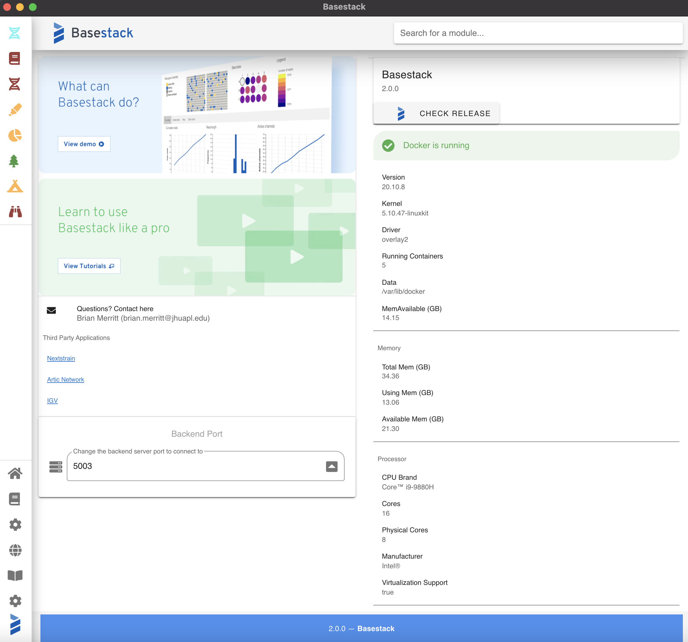
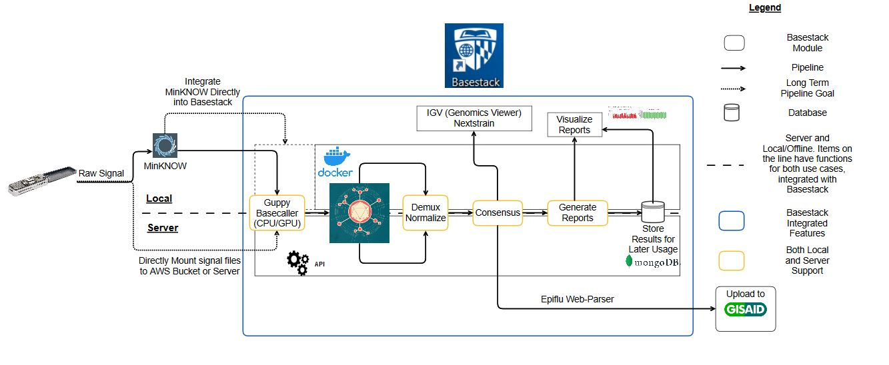

Basestack
=======================================

Basestack is a platform for rapid and real time analysis of Nanopore generated sequencing data. 
  Basestack comes bundled with a series of both cutting edge public tools, 
  some modified by JHU built phylogenetic and genomic pipelines, all integrated into a user interface 
  ( that is quickly and seamlessly installable on all standard laptops on any of the major operating systems used today. 
  Ultimately, the suite provides users with a means of quickly and accurately generating consensus sequences from viral 
  data within minutes of starting. In addition, we provide a system for automated updates once the application is installed 
  for any future changes or additions to the application that is fundamentally built upon the Docker Container ecosystem.

Please follow the sidebar links to review both installation steps for your distribution and additional information on the underlying pipelines.

Basestack's recent releases can be found at: https://github.com/jhuapl-bio/Basestack/releases/

Future Architecture for Consensus Generation

