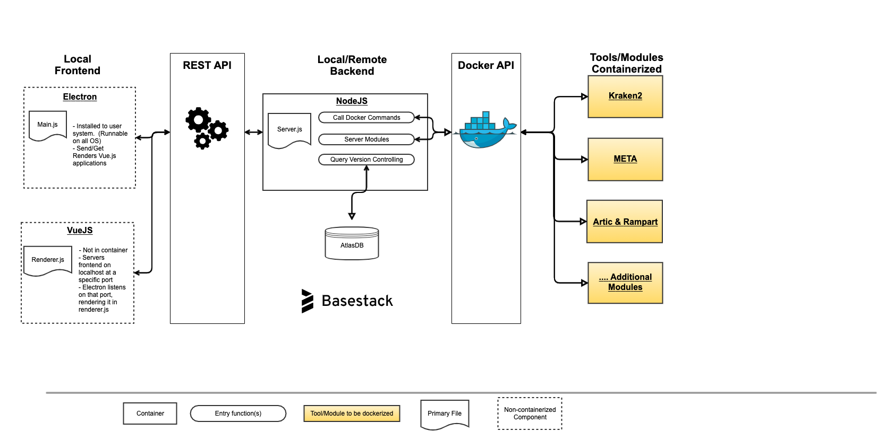

.. _api:

API
===

Development Setup of Server and App
-----

.. code-block:: console

   conda activate basestack
   npm run dev:server
   npm run dev:app (if running the app in parallel)

Components
---------

.. toctree::
    :maxdepth: 2
    :caption: API Reference

    api_modules
    api_procedures
    api_job
    api_system
