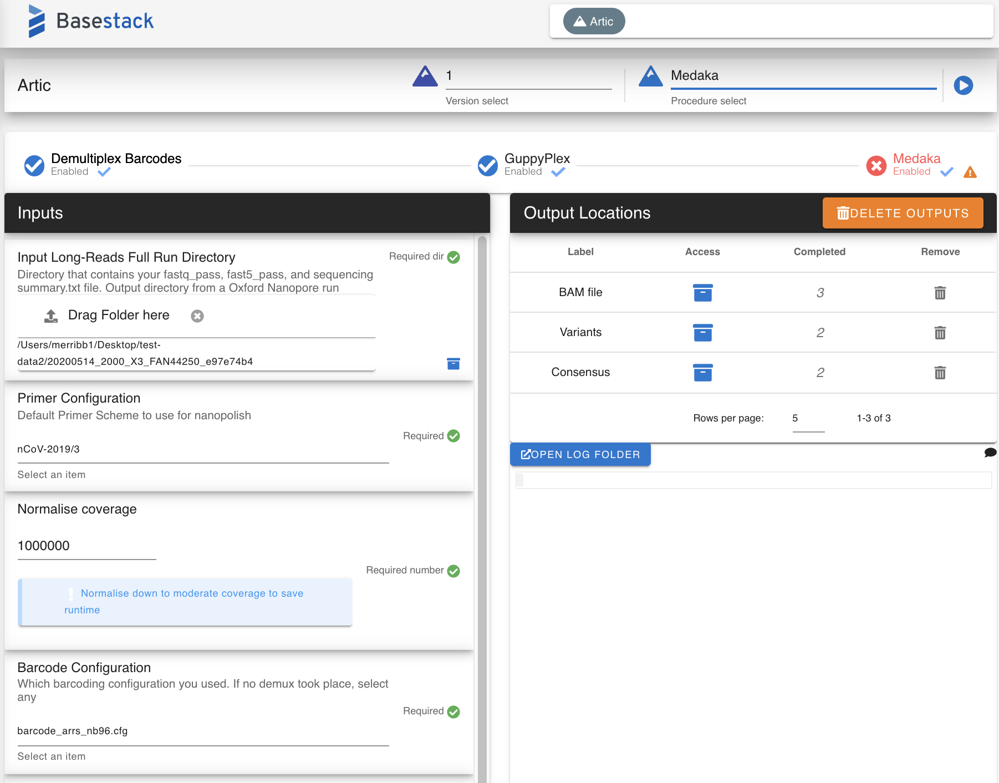
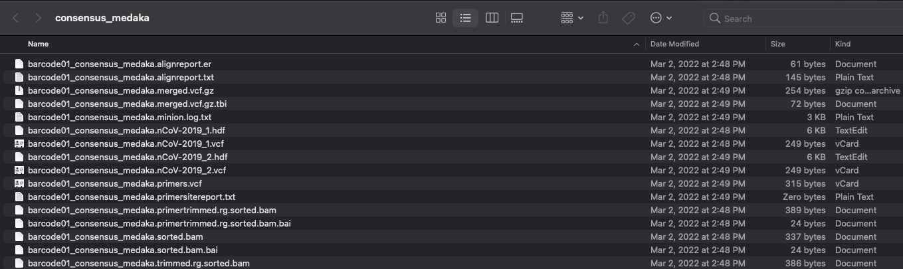
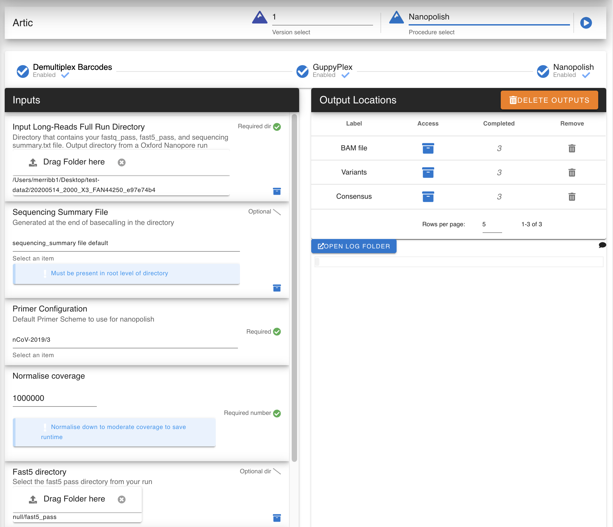
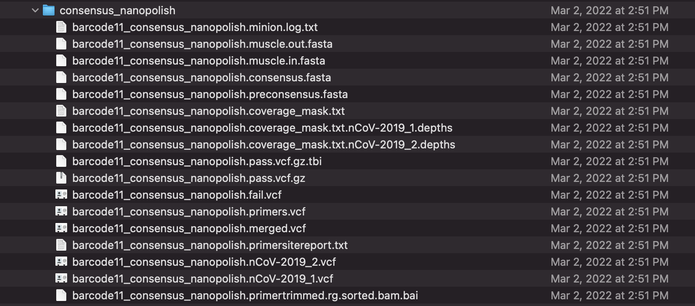

Artic
-----

`Artic <https://github.com/artic-network/fieldbioinformatics>`_ is a tool designed for analyzing and creating consensuses from viral nanopore sequencing reads. These also are tied to the use of amplicon schemes (tiled)

.. note::
   This module will output multiple consensuses per barcode of interest. It takes in a raw fastq_pass directory and outputs `.vcfs`, `.fasta`, and `.bam` files for further use

.. Artic - Medaka:

Medaka
^^^^^^^^^^

.. note:
   Full source code for medaka, which is baked into the artic pipeline, is available `here <https://github.com/nanoporetech/medaka>`

-------
Parameters
-------

- input run folder: `directory` 

   Must contain a ``fastq_pass`` directory or a custom inputted one (See below)

- Primer: `option or Directory`

   Artic Primer set or a custom one (directory) which contain the ``genome.fasta`` and necessary ``BED`` file for the primer set

- Normalize Coverage: `Number`

- Barcode Configuration: `option`

   Which barcode kit you used for demux. Select any for non-barcoded sample

- FASTQ Dir: `Directory, optional`

   Select your own custom `fastq_pass` directory to analyze and demux

- Medaka Model: `option`

   FAST or HAC used during basecalling

-------
Returns
-------

1. Medaka Consensus files: `FASTA files containing your consensuses for each barcode`
2. Medaka VCF files: `Variant files containing your variant calls for each barcode`
3. Medaka BAM files: `BAM files containing your alignment information for each barcode`

.. _Artic - Nanopolish:

Nanopolish
^^^^^^^^^^

.. note:
   Full source code for medaka, which is baked into the artic pipeline, is available `here <https://github.com/jts/nanopolish>`

-------
Parameters
-------

- input run folder: `directory` 

   Must contain a ``fastq_pass`` directory or a custom inputted one (See below)

- Primer: `option or Directory`

   Artic Primer set or a custom one (directory) which contain the ``genome.fasta`` and necessary ``BED`` file for the primer set

- Normalize Coverage: `Number`

- Barcode Configuration: `option`

   Which barcode kit you used for demux. Select any for non-barcoded sample

- FASTQ Dir: `Directory, optional`

   Select your own custom `fastq_pass` directory to analyze and demux

- Sequencing Summary File: `File, exists`

   Selects the Sequencing summary file in the root of your run directory

   .. note::
      Oftentimes, this file can be found in the ``fastq_pass`` directory. Move it one level up to the root run directory

-------
Returns
-------

1. Nanopolish Consensus files: `FASTA files containing your consensuses for each barcode`
2. Nanopolish VCF files: `Variant files containing your variant calls for each barcode`
3. Nanopolish BAM files: `BAM files containing your alignment information for each barcode`
