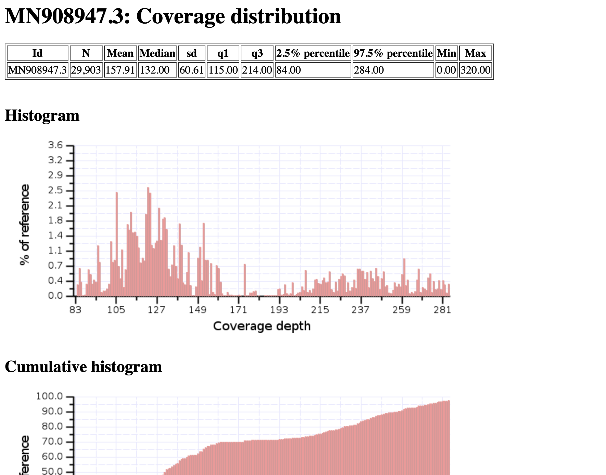

Bamstats
-----

`Bamstats <https://github.com/guigolab/bamstats>`_ is a tool designed compute mapping stats from a BAM file, often output from alignment methods

.. note::
   This module outputs a zipped folder that contains your necessary information

-------
Parameters
-------

- input BAM: `file` 

   This is often output from alignment methods like ``bwa``, ``bowtie2``, or ``minimap2``. Additionally, you can receive BAM files from modules within Basestack such as:
   
   1. :ref:`Basestack Consensus`
   2. :ref:`Artic - Medaka`
   3. :ref:`Artic - Nanopolish`

-------
Returns
-------

Bamstats Report zipped : `bamstats_report.zip, HTML-containing directory`
   

