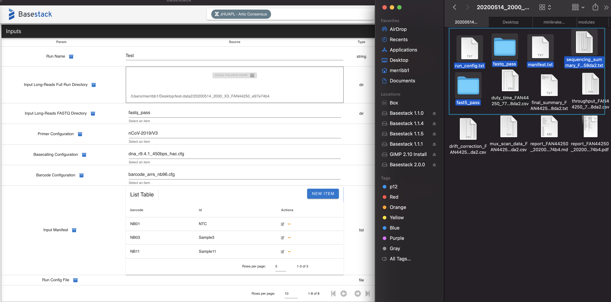
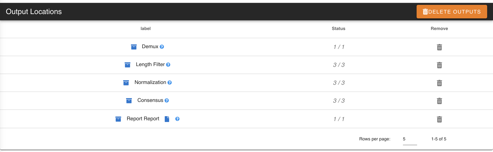

Basestack_Consensus
------

Running Consensus Generation and Reporting
###  

Consensus Generation is the main feature of this application and is used to generate a report of a run directory that was generated from a MinION run. It has multiple steps but is designed to be very automated once a job is submit for analysis.

If you haven't already done so, download and unzip the `Test data <https://drive.google.com/file/d/1zrgwheJxhMTvd7zu0fuRhVYYM0aGY5XS/view?usp=sharing>`_ folder

Starting a Run
**********************

1. Select the appropriate test folder first. This folder is either included in the `test-data` folder in the source of this application OR you can retrieve it within the install location of the app. For example, in `C:\Program Files\Basestack\client\data\test-data`. 
	- You can either drag + drop it into the *Run Folder* field or select it by left clicking and browser to the directory location on your computer

2. Once a folder has been input, you should see the text fields populate and turn green. If any field is marked as read, it is invalid and should be looked at further for proper formatting. These files should be valid for the test dataset. If you want to use your own data please follow the formatting in `run_config.txt`, `run_info.txt`, and `manifest.txt`. These formats are like:

.. note::
    You may skip this portion if you'd like

1. ``run_config.txt``

- This should be 3 rows that dictate the primer (first), basecalling workflow (second), and barcoding cfg (third/last). Separate by tab. 

Example:

+--------------------+---------------------------+
| Target (Unlisted)  | Config (Unlisted)         |
+====================+===========================+
| primers            | nCov-2019/V3              | 
+--------------------+---------------------------+
| basecalling        | dna_r9.4.1_450bps_hac.cfg | 
+--------------------+---------------------------+
| barcoding          | barcode_arrs_nb96.cfg     | 
+--------------------+---------------------------+

2. ``manifest.txt``

Example:

+-------------------+----------------------+
| Barcode           | Sample               |
+===================+======================+
| NB01              | NTC (always required)|
+-------------------+----------------------+
| NB02              | MDHP-00058           |
+-------------------+----------------------+
| NB03              | MDHP-00059           |
+-------------------+----------------------+
| .                 | .                    |
+-------------------+----------------------+
| .                 | .                    |
+-------------------+----------------------+

.. note:: 
    If you don't have an NTC (NOT RECOMMENDED EXPERIMENTALLY), set ``NTC`` as ``NB00``

- This should be any number of rows that contain barcode on the left ALWAYS and the sample code on the right. A no-template-control (NTC) must always be specified for a report to be completed. Separate by tab.
- You are allowed to input your own custom values for each of the 3 files where the app will overwrite that corresponding file on a job submission. That means you can populate these fields by either directly modifying the files OR by inputting them into the input fields
	- These values are currently not validating to their greatest extent so take care to correctly input values and delimit them with tabs if doing this manually.

Lastly, there are three files that are made following a successful sequencing (and basecalling) run. These three are

1. Sequencing Summary **REQUIRED**
	- This file is made following **basecalling**. It contains the mapping and summary stats of all fast5 to fastq generations and must be present in the run directory for report generation
	- If using CLI or stand-alone **basecalling** you will likely need to move this file from the fastq output savepath **to** the base run directory. 
2. Throughput....csv **OPTIONAL**
3. Drift Correction **OPTIONAL**

Validating Input Directory
**********************

.. note::
    Once a folder is input and all greens are seen for the three main files, hit bookmark. The application will save all information and if any error occurs it will be reported appropriately. Please be aware that the software does not catch everything that could go wrong before a job submits

Starting the process
**********************

1. Once bookmarked, hit the newly-shown *Load* button to load it into the run. This will allow this tab and *RAMPART* to make use of your specified run directory. 

2. Hit `Make Consensus` to start consensus generation. 

.. note::
    Depending on your method of installing Docker on Windows, you may receive a notification for docker to share a folder. Hit okay to allow the pipeline to continue. If you run Basestack as an admin, this error will be avoided. You can also opt to share the Basestack folder and sub-folders in the Docker Desktop on Windows as well (see how to do this in the next 2 images)

.. image:: ../assets/img/filesharingoverview.PNG
   :width: 600

.. note::
    Simply select the folder that contains the `Basestack.exe` file by selecting the plus-mark and navigation and selecting it within the browser. In this example it is: `...\build\win-unpacked`

Checking Logs and Status
**********************

.. note::
    You can see the output of the run in the `Log Streams` tab on the left. You can also see the *Statuse(s)* column begin to change as modules are completed for your run. The final module is the report generation module and should always be *1/1* when complete

Final Report
**********************

.. note::
    Once complete, you can view the pdf report by clicking the *pdf* link underneath the final row's status of *1/1*. You can also traverse to any of the module directories by hitting the link text on the first column for each module. In this example, I've chosen *Report Generation* as my link which is a top-level view of all modules, as well as the `report.pdf` location. Open this pdf to see your report either from the folder or the *pdf* link on the left-most column to see your results!

