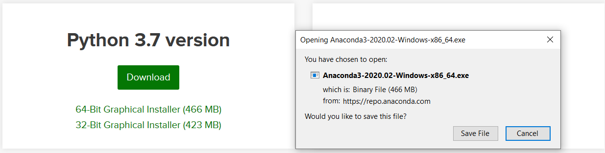
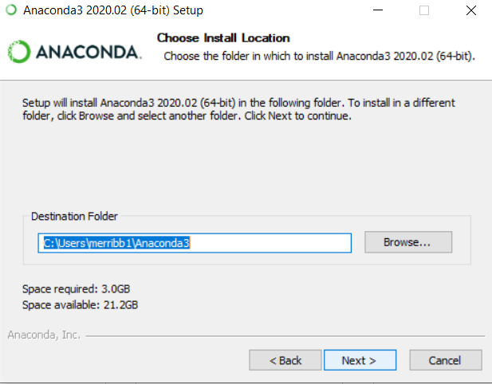

Setup Developer Installation (OPTIONAL)
----

Prereq: `python3`, `miniconda` or `anaconda` environment (Windows Developers only. Installation handled for Mac and Linux in `make` process)

1. Install `make`
	- If on Windows you can get this in a conda environment
2. Clone this repo using `git clone`. 
	- All source code will be obtained in the folder. 
3. Build Conda Environment using `conda`
	- `conda env create -f environment.yml`
	- `conda activate basestack`
4. Build the App or Run in Development Mode
	- Building the app and dependencies `make build-[unix|win]`
	- Running hot reload for development `make dev`
		- Dependencies must be already installed with `make build-[unix|win]`

Only do this step (below) if you don't have conda installed

https://docs.anaconda.com/anaconda/install/

Examples:

	Ubuntu: 
		- wget  https://repo.anaconda.com/archive/Anaconda3-2019.10-Linux-x86_64.sh
		- bash Anaconda3-2019.10-Linux-x86_64.sh
	Mac 
		- https://docs.anaconda.com/anaconda/install/mac-os/
	Windows 
		- https://www.anaconda.com/distribution/#windows

Conda on Windows Install Process 
#####

1. Select **Python3.7** version of Anaconda to install and choose **Save File**

2. Wait for the process to bring up the user interface. Select **Next** several times until you get to the install directory location

If you'd like a new install location specify here. You will need to supply this path for **Step 2**

Note
##### 

* Both the back and frontend will be started by this command. However, we intend in future releases to utilize websockets to update information to the user interface rather than a separate backend server being served on the host. 

* If you want to build for distros that aren't your own (e.g. Build windows on an ubuntu machine), you will need to download the required third-party apps for this (in this example, wine). Take a look [here](https://www.electron.build/multi-platform-build) for more documentation. You can't run `make build[unix|win]` either, you must run the `npm` commmand for it (located in `client/package.json`).
	- You can run `npm run build:[win,linux,mac-dmg, mac-zip]` to accomplish this in `client`. Leave the value after `:` blank if you want to opt for your host platform.
	- Currently, there is not support for building a .dmg file on another OS (Windows, Linux). You will have to build a zip folder with the app with `npm run build:mac-zip`. Mac users can run the default build OR `npm run build:mac-dmg`
