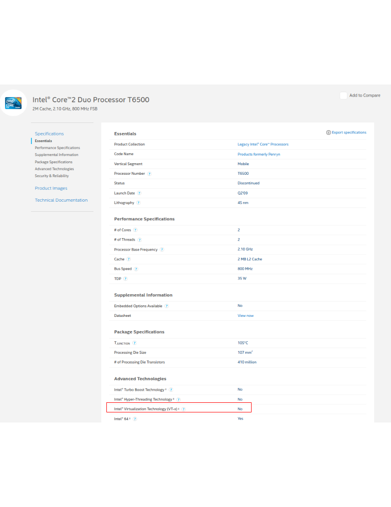
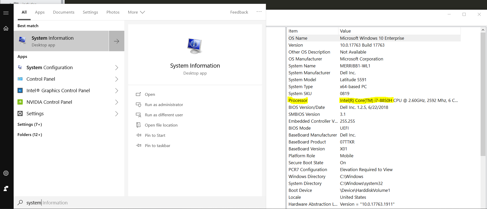
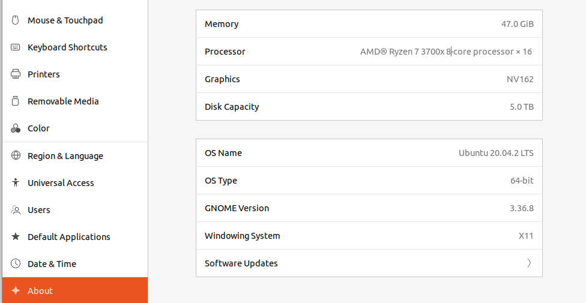

Checking Docker Support
##### 

.. _check docker:

In order to run docker you must be able to support virtualization from your CPU. This feature must also be enabled within your BIOS and Windows Features. See more of [Troubleshooting]({{site.baseurl}}#virtualization-disabled---windows ) for more details

If you're unsure whether docker is supported by your specific cpu, please visit:

- `Intel <https://ark.intel.com/content/www/us/en/ark.html>`_
- `AMD <https://www.amd.com/en/products/specifications/processors>`_

and input your specific model number.

Type Your Model Number, e.g. T6500 into the product search bar

In this example above, you can see that Vt-x (Virtualization) is not supported. This will be a **Yes** if it is supported.

To find the cpu model on Windows:

On Mac or Ubuntu you can find this value in the About page e.g. on Ubuntu:

