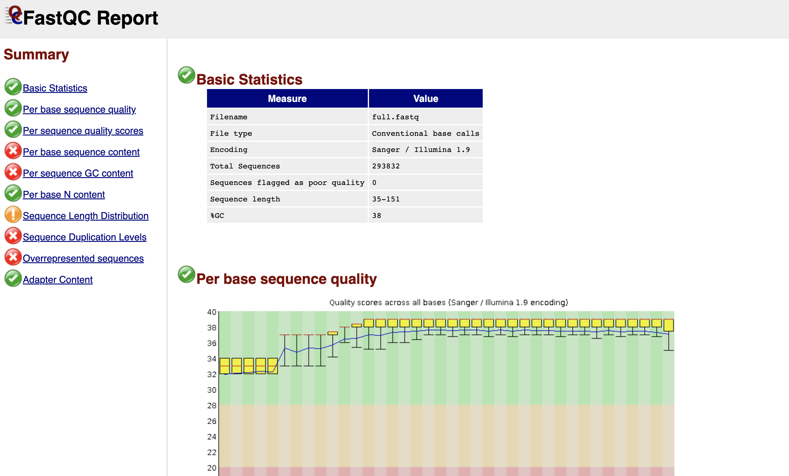
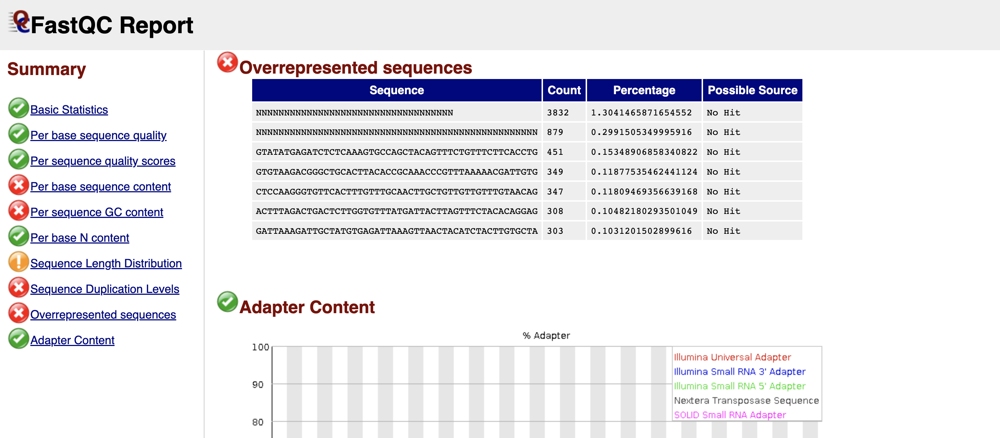

FastQC
-----

`FastQC <https://www.bioinformatics.babraham.ac.uk/projects/fastqc/>`_ is a tool designed to view the quality and do control on raw sequencing data, primarily for illumina reads 

.. note::
   This module outputs an html file that is a report of your raw sequencing data

-------
Parameters
-------

FASTQ-containing Directory : `Directory` 
   Directory that contains one or more ``fastq`` files

-------
Returns
-------

Report file : `HTML file`
   

