Guppy Minknow
-------

MinKNOW
#####

In order to run the MinION sequencer, you first need to download/install the necessary software from Oxford Nanopore's mirror(s). 
::
    wget -O- https://mirror.oxfordnanoportal.com/apt/ont-repo.pub | sudo apt-key add -

    echo "deb http://mirror.oxfordnanoportal.com/apt $(lsb_release -c | awk '{print $2}')-stable non-free" | sudo tee /etc/apt/sources.list.d/nanoporetech.sources.list

    sudo apt-get -y update

    sudo apt-get install -y minion-nc

.. note:: 
    See `here <https://community.nanoporetech.com/protocols/experiment-companion-minknow/v/mke_1013_v1_revbz_11apr2016/installing-minknow-on-linu>`_

Next, we need to install guppy on your system. Skip this step if you are not using a GPU in your system. 

PLEASE NOTE: this option is available only for Linux-based distributions. You have to use CPU-mode for Windows (Fast config basecalling mode)

Running the app
^^^^^^^

Select Minknow from the Quick-launch location in Ubuntu. Usually, this is in the bottom-left section of the screen. You should see the MinKNOW icon

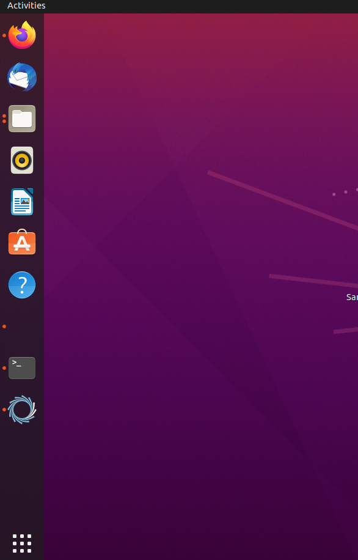

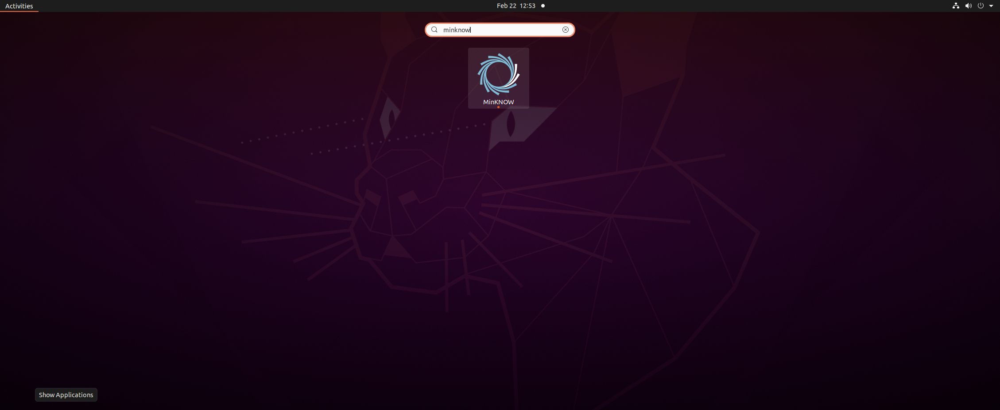

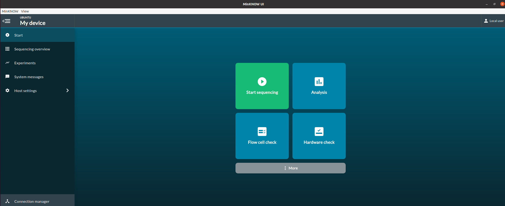

.. note::
    If you dont set your analysis to run offline, you will see a window that asks you to login. Please follow instructions below to disable online-mode

Testing Guppy Basecaller from MinKNOW
^^^^^^^^

First, select the ``Start`` at the top-left. Then, select ``Basecalling``

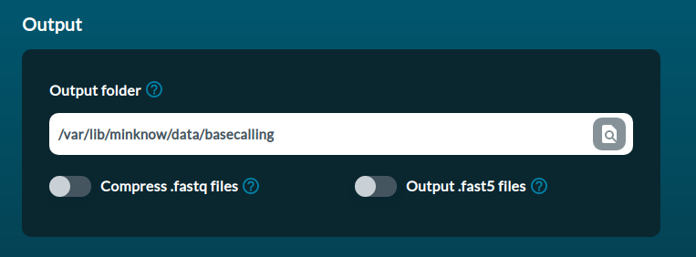

.. note:: 
    By default, all sequencing runs will output to /var/lib/minknow/data on Linux machines. 

.. warning::
    To run basecalling from the UI, you MUST ensure that permissions allow reading + writing for the ``minknow`` group on Linux machines

Here, you must select the basecalling configuration you'd like to use

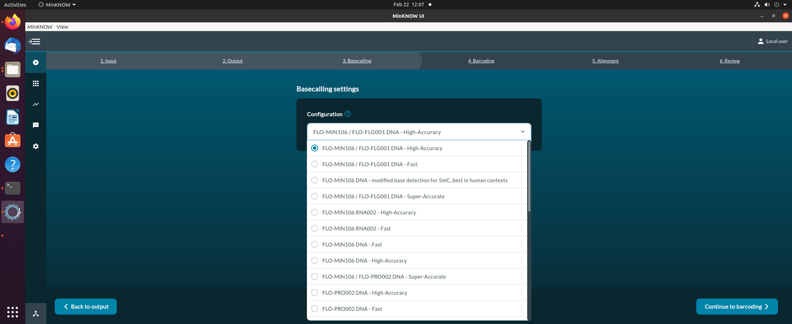

Most, when running the MinION or MK1C, will use the ``FLO-MIN106 / FLO-FLG001 DNA`` options, it is the default option.

Next, pick whether you want the High-Accuracy or Fast configurations (in the names)

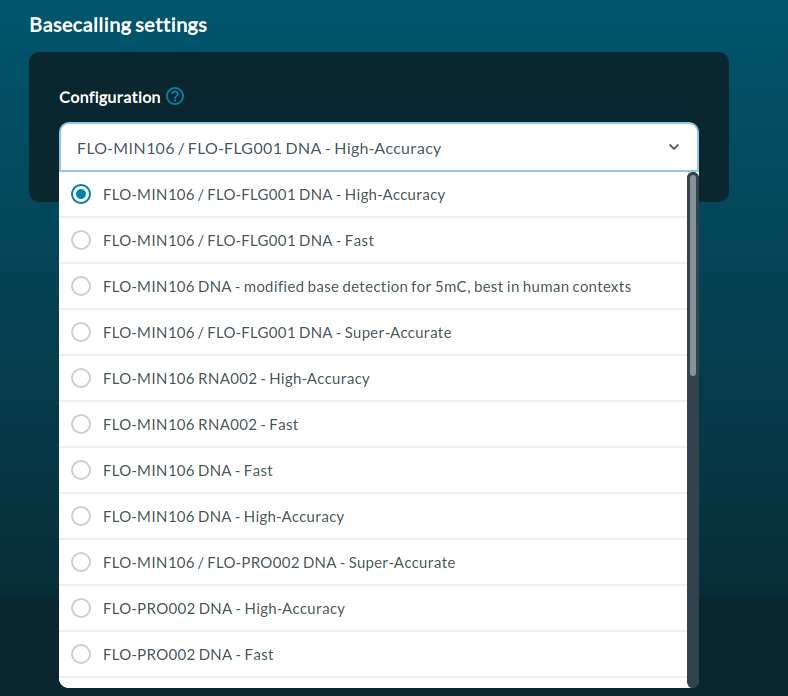

.. note::
    High-Accuracy is RECOMMENDED if using a GPU-capable laptop with a CUDA-compatible device. Make sure you set up GPU basecalling as described here `Guppy GPU Basecaller`_
    Fast accuracy is optional but is RECOMMENDED for non GPU-capable laptops/devices. It will run everything using a CPU. 

.. warning::
    If sequencing, it is generally not recommended to run basecalling at the same time if using ``Fast``, CPU-only. This is because the system can get overloaded and crash the application

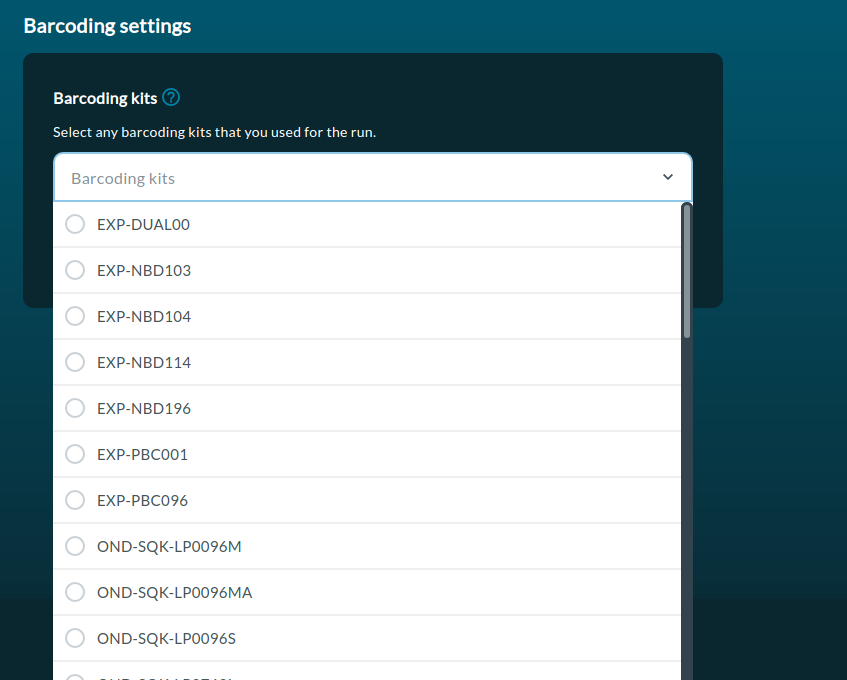

.. note::
    If you don't see any barcoding kits, go here `Barcoding Kits Missing`_ to fix

Move through the rest of the configurations until you finally can hit ``Start``, the green button at the bottom-right of the page

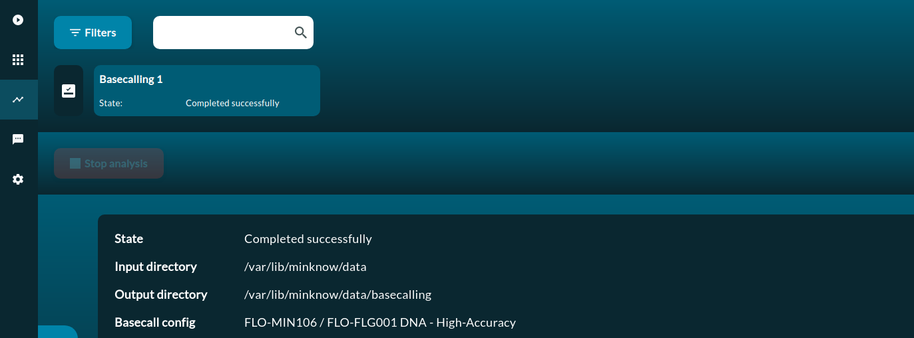

.. note::
    The progress should begin to update as the process goes forward. 
..warning::
    If it errors out, check logs by selecting the right arrow or by looking at all files (recently made) at ``/var/log/minknow``. Oftentimes it is an issue with permissions

Oxford Community Forums
^^^^^^^^^

Oxford provides a very active forum for users of ONT software and hardware to interact and post questions or solutions to issues. 

Additionally, the Oxford team will oftentimes provide helpful information on their devices or software

First, head to https://community.nanoporetech.com/

You will need to make an Oxford account to do so. Please register for an account as all Oxford hardware users should have the ability to login and view the community pages available on the site

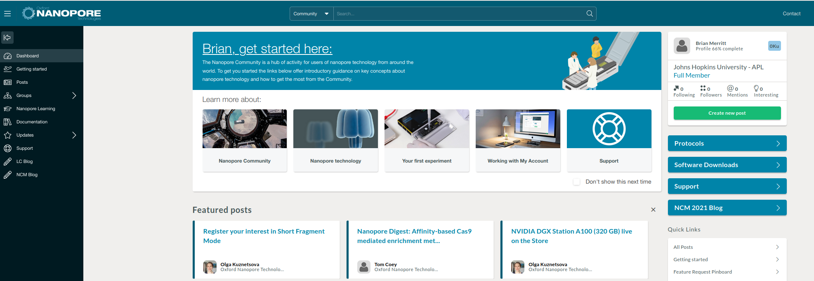

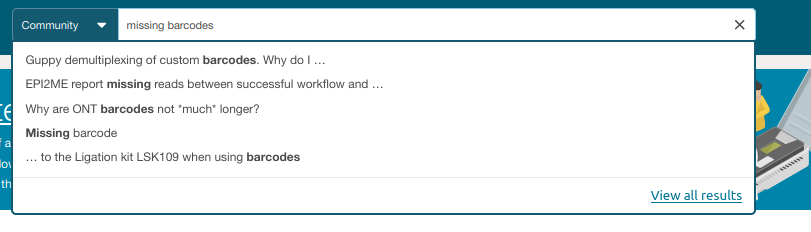

Now, lets run through an example. We discussed earlier (as a warning) that sometimes you may not see the barcoding kits when basecalling your runs
This is a common bug that was found with one of the patches for the MinKNOW software, caught by some community members

Simply look at the top of the page and enter your query. In this example, lets type "missing barcodes kits" where you will get some suggested items. Either hit ``Enter`` to view all items or select one of the quick-launch items

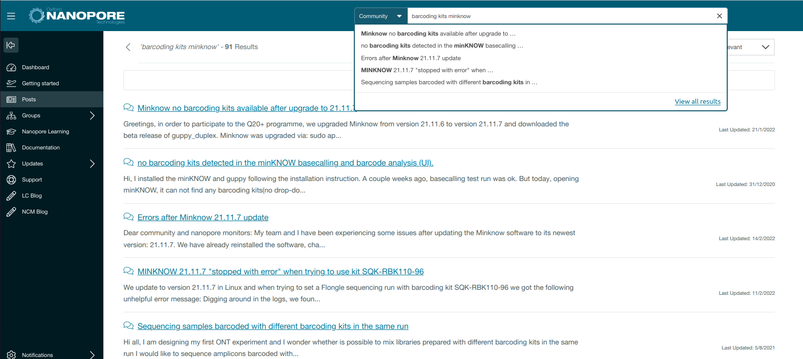

This site is an invaludable tool if you're experiencing issues with your software or hardware. Oftentimes, responses to updates or issues are quick, so it is highly recommended to follow these forums from time-to-time

Viewing downloads
^^^^^^^^

Oxford also provides a set of software links you can download applications from. These are available at https://community.nanoporetech.com/downloads

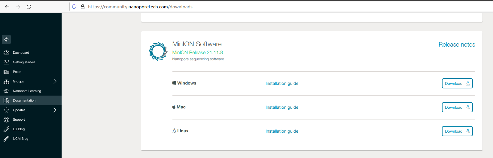

Setting Up Guppy for GPU
^^^^^^^^

See `here <https://community.nanoporetech.com/protocols/experiment-companion-minknow/v/mke_1013_v1_revbz_11apr2016/installing-gpu-version-of-guppy-with-minknow-for-minion>`_ for more advanced details

If you have a CUDA-capable GPU in your laptop, follow `CUDA`_ and the above link to set it up for MinKNOW

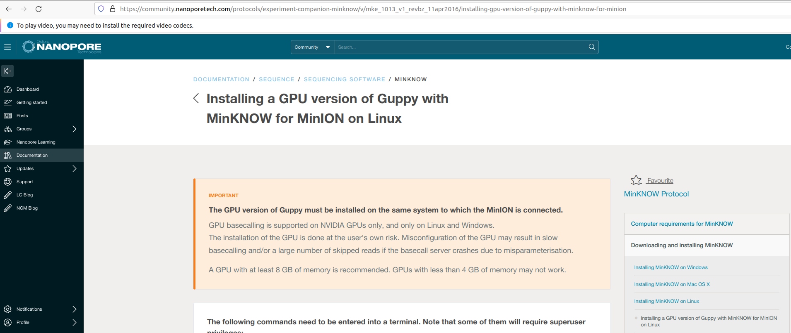

.. note::
    Running GPU basecalling is not required if you prefer to run it from the command line, detailed here `Guppy GPU Basecaller`_ 

.

CUDA
#####

Ensure that your GPU is CUDA-capable first by typing
::
    lspci | grep VGA

If you see your GPU model, for example: `NVIDIA Corporation TU102 [GeForce RTX 2080 Ti] (rev A1)` then you have a GPU available on your machine. IF you don't see that AND you know there is a GPU in the machine try to install the drivers first.

Once the drivers are installed go to: https://developer.nvidia.com/cuda-downloads. 

Select the appropriate distribution values and copy+paste the commands that populate into your terminal, one-by-one. 

On my Ubuntu 20.04 (Focal) machine I head to [here]( https://developer.nvidia.com/cuda-downloads?target_os=Linux&target_arch=x86_64&=Ubuntu&target_version=20.04&target_type=deb_local )

then copy + paste
::
    wget https://developer.download.nvidia.com/compute/cuda/repos/ubuntu2004/x86_64/cuda-ubuntu2004.pin
    sudo mv cuda-ubuntu2004.pin /etc/apt/preferences.d/cuda-repository-pin-600
    wget https://developer.download.nvidia.com/compute/cuda/11.6.1/local_installers/cuda-repo-ubuntu2004-11-6-local_11.6.1-510.47.03-1_amd64.deb
    sudo dpkg -i cuda-repo-ubuntu2004-11-6-local_11.6.1-510.47.03-1_amd64.deb
    sudo apt-key add /var/cuda-repo-ubuntu2004-11-6-local/7fa2af80.pub
    sudo apt-get update
    sudo apt-get -y install cuda

You should then reboot your machine for everything to take full effect

Once installed you can confirm that it is working by writing: 
::
    nvidia-smi

    and

    nvcc --version

If both commands return a healthy output, you are all set on CUDA.

Barcoding Kits Missing
####

Newer installs of Minknow will not render barcoding kits appropriately on starting an analysis or sequencing run. To remedy, you must fix 2-3 files

1. ``sudo nano /opt/ont/minknow/conf/app_conf`` and replace ``use_tcp`` to ``true``
2. ``sudo systemctl edit guppyd.service`` and replace ``--port`` with ``5555`` and add ``--use_tcp``
3. ``sudo nano /etc/systemd/system/guppyd.service.d/override.conf`` and replace ``--port`` with ``5555`` and add ``--use_tcp``
4. Finally, run ``sudo systemctl daemon-reload`` to make changes. 

.. note::
   Latest Installs of MinKNOW break GPU-basecalling. There is no fix (we've) discovered that allows it to perform within MinKNOW directly

.. note::
    ``/etc/systemd/system/guppyd.service.d/override.conf`` may not exist on your system and won't be needed to be changed

Guppy GPU Basecaller
####

Finally, you need to configure MinKNOW to use a GPU-capable version of guppy and that the guppy basecaller plays nice with the installed MinKNOW you've pulled. 
::
    /opt/ont/minknow/guppy/bin/guppy_basecaller --version

You should see a version, for example for 5.0.13. In MinKNOW ``21.11`` it should be around ``5.1.15`` You MUST download the same version by running:

``wget https://mirror.oxfordnanoportal.com/software/analysis/ont-guppy_<version>_linux64.tar.gz``

Make sure to replace the installed version with the values after ``ont-guppy_`` e.g. ``wget https://mirror.oxfordnanoportal.com/software/analysis/ont-guppy_5.1.15_linux64.tar.gz``

Then, we need to replace the guppy version. Let's first save the cpu-only one before replacing as well. 
::
    sudo mv /opt/ont/guppy/bin /opt/ont/guppy/bin.sav  &&    sudo mv /opt/ont/guppy/data /opt/ont/guppy/data.sav      # Save the old guppy just in case
    tar -xvzf ont-guppy_5.1.15_linux64.tar.gz #Decompress guppy. Replace the version number with your own
    sudo cp -r ont-guppy/bin /opt/ont/guppy/bin && sudo cp -r ont-guppy/data /opt/ont/guppy/data # Move the newly downloaded guppy
    #Disable online need for minknow to ping external servers
    sudo /opt/ont/minknow/bin/config_editor --filename /opt/ont/minknow/conf/sys_conf --conf system --set on_acquisition_ping_failure=ignore
    sudo service minknow restart # Restart minknow

Then, add these two lines to your `$HOME/.bashrc`
::
    export LD_LIBRARY_PATH=/usr/local/cuda/lib64\
                            ${LD_LIBRARY_PATH:+:${LD_LIBRARY_PATH}}
    export PATH=/usr/local/cuda/bin:$PATH

.. note::
    Add this to your bashrc for the user if you want to run guppy gpu from the command line

.. warning::
    If you perform the above steps and you still can't access/see the GPU with ``nvidia-settings`` or ``nvidia-smi``, you might need to disable secure boot
    `Here <https://www.gigabyte.com/us/Support/FAQ/3001>`_ or `here <https://docs.microsoft.com/en-us/windows-hardware/manufacture/desktop/disabling-secure-boot?view=windows-11#:~:text=Find%20the%20Secure%20Boot%20setting,Save%20changes%20and%20exit>`_ are examples of how to do that. You need to enter BIOS to perform this operation

    1. Boot and press [F2] to enter BIOS.
    2. Go to [Security] tab > [Default Secure boot on] and set as [Disabled].
    3. Go to [Save & Exit] tab > [Save Changes] and select [Yes].
    4. Go to [Security] tab and enter [Delete All Secure Boot Variables] and select [Yes] to proceed.
    5. Then, select [OK] to restart.

    OR    

    1. Open the PC BIOS menu:

        You can often access this menu by pressing a key while your PC is booting, such as F1, F2, F12, or Esc.

        Or

        From Windows, hold the Shift key while selecting Restart. Go to Troubleshoot > Advanced Options: UEFI Firmware Settings.

    2. Find the Secure Boot setting in your BIOS menu. If possible, set it to Disabled. This option is usually in either the Security tab, the Boot tab, or the Authentication tab.

    3. Save changes and exit. The PC reboots.

.. note::

    As of 21.06, MinKNOW requires an additional step to add CUDA capability (GPU processing) to basecalling and can be found `here <https://community.nanoporetech.com/posts/gpu-version-of-guppy-doesn>`_

    See `here <https://community.nanoporetech.com/protocols/experiment-companion-minknow/v/mke_1013_v1_revbz_11apr2016/installing-gpu-version-of-guppy-with-minknow-for-minion>`_

    In short, the fix quoted at the link states that it requires about 10 steps: 

    1. Use systemctl to edit the existing guppyd service (this will open a text editor with a copy of the existing service file):

    ``sudo systemctl edit guppyd.service --full``

    Ensure that, if it exists, the override conf doesn't override our changes 

    ``sudo mv /etc/systemd/system/guppyd.service.d/override.conf /etc/systemd/system/guppyd.service.d/override.conf.old``

    2. Edit that new service file to point to your GPU version of guppy, and add the appropriate device flag. You can change any other server arguments at the same time.

    For example, change this line in the service file:

    ``ExecStart=/opt/ont/guppy/bin/guppy_basecall_server <things>``

    ...to this (make sure you retain the ``--port`` argument exactly as it used to be -- this is how MinKNOW communicates with the basecall server):

    ``ExecStart=/home/myuser/ont-guppy/bin/guppy_basecall_server <things> -x cuda:all``

    3. Save the file and exit the text editor (the filename may look odd, but don't worry -- systemctl should change it to the correct name later).

    4. Do the same for ``/etc/systemd/system/guppyd.service.d/override.conf`` (edit with the addition of `-x cuda:all`)

    5. Stop the MinKNOW service, as described in the documentation.

    6. Stop the guppyd service.

    ``sudo service guppyd stop``

    7. Check that guppy is no longer running, as described in the documentation, killing any existing basecall servers as required.

    8. Start the guppyd service.

    ``sudo service guppyd start``

    9. Check that the correct version of guppy is running, as described in the documentation. If the guppy basecall server isn't launching correctly, check its log output using journalctl ("-n 100" shows the last 100 entries in the journal) to see what's going wrong:

    ``sudo journalctl -u guppyd.service -n 100``

    10. Start the MinKNOW service.

    ``sudo service minknow restart``

    You will also need to adjust the configuration file for guppy by modifying ``/opt/ont/minknow/conf/app_conf``. Adjust the ``gpu_calling`` field to true in the JSON, being careful not to modify/delete any commas or quotations.

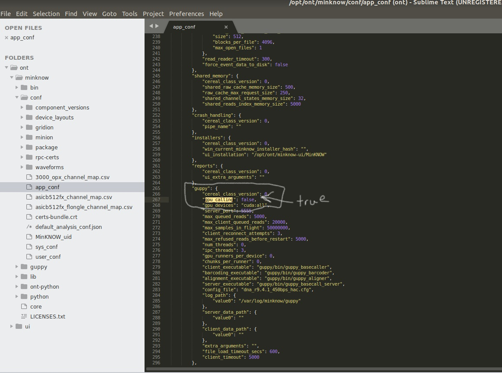

From there you are all set to run basecalling directly within the MinKNOW application.

If you ever experience issues where the UI does not show experiments once started (Basecalling or Sequencing), try:

1. Close MinKNOW (UI)
2. `sudo service minknow restart`
3. Make sure that a MinION or other Oxford Nanopore devices is plugged in and running
4. Restart MinKNOW (UI)
5. Re-attempt experiment such as basecalling. Often times experiments will then show up

Reduce Runners if GPU basecalling fails
#####

.. note::

    See `here <https://community.nanoporetech.com/protocols/experiment-companion-minknow/v/mke_1013_v1_revbz_11apr2016/installing-gpu-version-of-guppy-with-minknow-for-minion>`_

Occasionally, if you've set up GPU basecalling correctly, but still get errors, this may be due to too many runners being called. You can adjust this 
easily in the ``app_conf`` file. Adjust the ``"chunks_per_runner"`` parameter

- If using HAC, set it to ``"chunks_per_runner": 160``
- If using SUP, set it to ``"chunks_per_runner": 10``

Running Command-line GPU Basecalling
####

.. note::
    Ensure you've installed a GPU compatible variant by following `Guppy GPU Basecaller`_.

Example command 
*****

.. code-block:: 

    guppy_basecaller -x cuda:all -i <fast5_folder> -r -s ./fastq_pass -c dna_r9.4.1_450bps_hac.cfg

.. note::
    If you get an error (or it doesn't exist) about ``guppy_basecaller`` not supporting GPU calling, please place the binaries in your path. 

    If you set up MinKNOW to use guppy GPU, ensure that it is properly working and setup in ``/opt/ont/guppy``. Follow `Guppy GPU Basecaller`_ to set this up
    Ultimately, you need to run the ``ont-guppy/*`` contents into ``/opt/ont/guppy/``

    To check your status of your GPU (ensure CUDA is installed by following `CUDA`_) by running ``nvidia-smi``

Reinstalling MinKNOW
#####

If you experience issues with MinKNOW, one potential solution is to do a purge of MinKNOW and Reinstalling

Notes (below) are gathered from the Oxford Community Forums `here <https://community.nanoporetech.com/posts/software-patch-release-21-9359>`_

1. First purge MinKNOW and remove its dependencies with these two commands:

.. code-block::

    sudo apt purge minion-nc

    sudo apt autoremove

2. Check that there are no residual config files left over:

.. code-block::

    dpkg --list | grep -e minknow -e minion -e guppy

3. If Step 2 returns any results, please manually purge those packages like so:

sudo apt purge package1 package2 package3 etc

4. Delete the minknow installation directory:

.. code-block::

    sudo rm -rf /opt/ont/minknow

5. Ensure there are no Guppy files or folders present in the following directory:

.. code-block::

    ls -l /etc/systemd/system/

6. If any Guppy files or folders are seen in Step 5, please delete them before continuing.

7. After rebooting your computer, update the package listing and install MinKNOW:

.. code-block::

    sudo apt update

    sudo apt install minion-nc

8. Once MinKNOW is installed, please open MinKNOW and start a test sequencing run with CPU basecalling to ensure it is working as expected before configuring your GPU. You can start an experiment with a CTC or used flow cell for the purposes of this test.

9. To configure your GPU, please follow Steps 1-15 on the this page of the MinKNOW user guide. Based on user feedback, we've updated it to make a few steps a bit clearer and I've confirmed on my own laptop that these work for this patch.