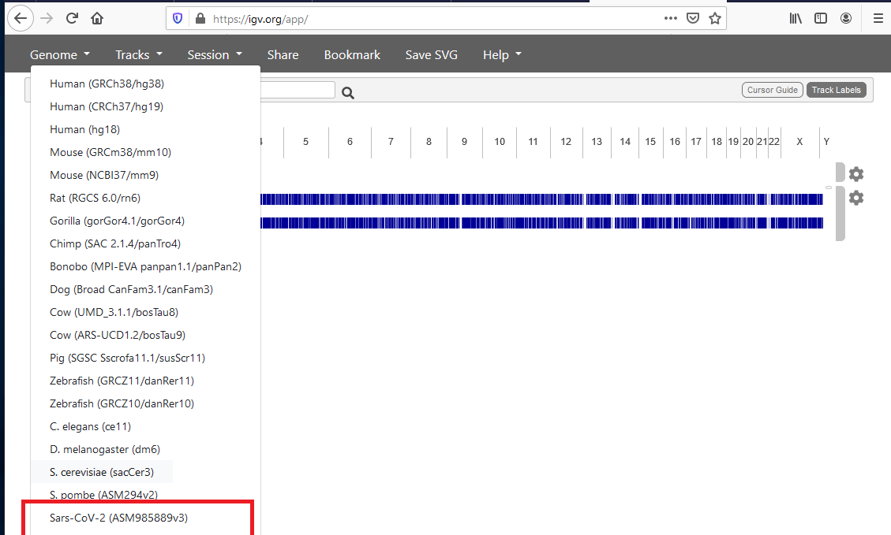
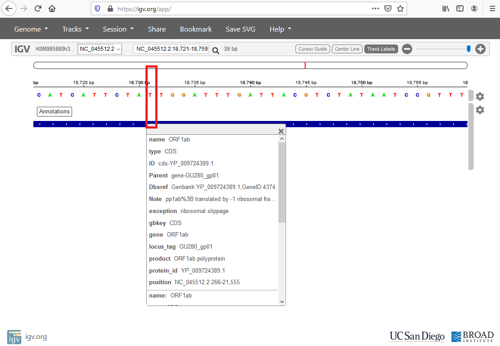

IGV
------

.. note:: 
    Requires Internet. Also available at https://igv.org/app/

IGV is an interactive environment that allows you to view a genome and see any annotations at a specific position. 

**These plots are also available in the Consensus Generation Pipeline Reports**

1. First, we are going to select our genome of interest, Sars-CoV-2.

2. For our example at position 18736, we can see that it belongs to ORF1ab from the reference and it has a T. As we saw in the report that T was change to a C when compared to the reference. We can also see what protein this position is a part of as well as supplemental information like the `protein_id` or `Dbxref` (references for external database resource)