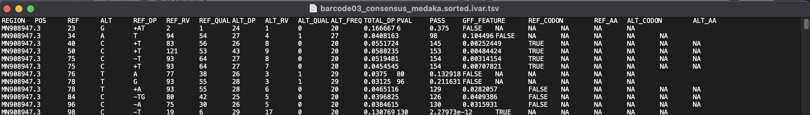
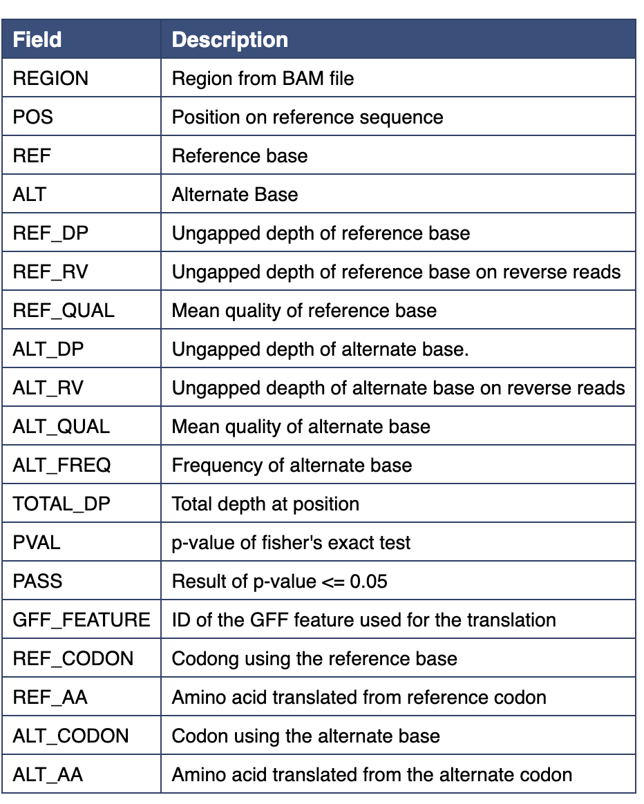

IVAR
-----

`IVAR <https://andersen-lab.github.io/ivar/html/>`_ 

iVar is a computational package that contains functions broadly useful for viral amplicon-based sequencing. Additional tools for metagenomic sequencing are actively being incorporated into iVar. While each of these functions can be accomplished using existing tools, iVar contains an intersection of functionality from multiple tools that are required to call iSNVs and consensus sequences from viral sequencing data across multiple replicates. We implemented the following functions in iVar: (1) trimming of primers and low-quality bases, (2) consensus calling, (3) variant calling - both iSNVs and insertions/deletions, and (4) identifying mismatches to primer sequences and excluding the corresponding reads from alignment files.

.. note::
   Definition of IVAR gathered directory from the above-mentioned github link

.. ivardefinition:

-------
Parameters
-------

- BAM file: `file` 

   - Alignment BAM file to search for coding regions from. Example pipelines/commands that generate a `bam` file are 
      - :ref:`minimap2def`
      - :ref:`Artic - Medaka`
      - :ref:`Artic - Nanopolish`
      - :ref:`Basestack Consensus`

- Reference GFF3: `option or File`

   - Coding region list that you want to use the alignment searching against
   - Optional, only used for the ``Variant`` service

- Reference FASTA: `File`
   - Your original reference FASTA file during alignment. Must also be linked to the GFF3 described above

-------
Returns
-------

1. IVAR Consensus FASTA: `file`
2. IVAR Output: `Tab-separated file`

.. note::
   Contains list of GFFs that map to variants that were called in the BAM file

.. note::
   Description of each field was gathered from the `Manual <https://andersen-lab.github.io/ivar/html/manualpage.html>`_