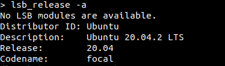
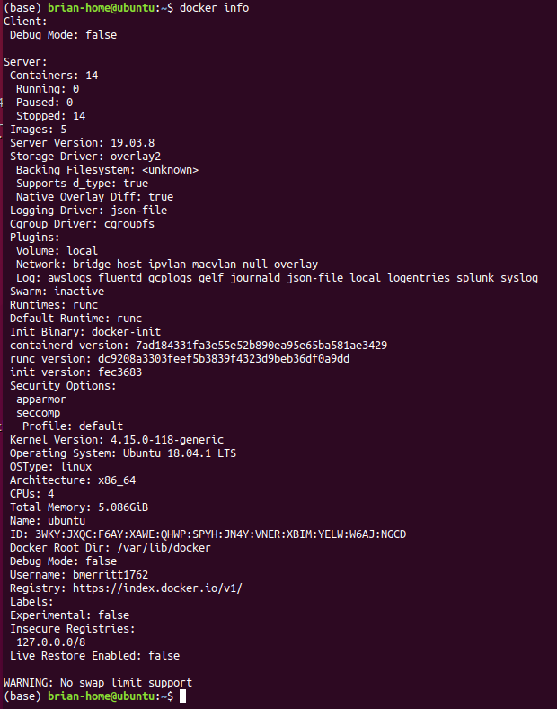
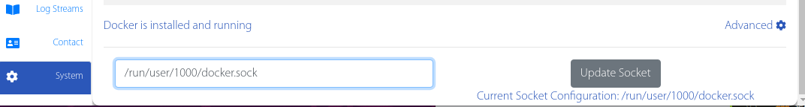
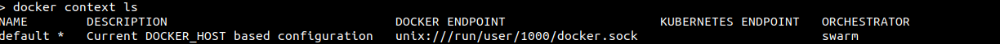

Docker
--------

Instructions
#######

Install `Docker <https://docs.docker.com/engine/install/#server>`_

.. collapse:: Check Processor support for Docker (Click to expand)

   	In order to run docker you must be able to support virtualization from your CPU. This feature must also be enabled within your BIOS and Windows Features. 
   
	If you're unsure whether docker is supported by your specific cpu, please visit and input your specific model number:

   	- `Intel <https://ark.intel.com/content/www/us/en/ark.html>`_
   	- `AMD <https://www.amd.com/en/products/specifications/processors>`_

   	Type Your Model Number, e.g. T6500 into the product search bar

   	.. image:: ../assets/img/intel_product_example_annotated.png
    	:width: 100%

   	In this example above, you can see that Vt-x (Virtualization) is not supported. This will be a **Yes** if it is supported.

	On Linux you can find the processor by typing on the command line: 

	.. image:: ../assets/img/about_ubuntu.png
		:width: 100%

.. raw:: html

   

Make sure that you select the appropriate distribution for your machine. If you are unsure of your distribution use `lsb_release -a` from the command line to check your distro.

.. _linux_docker:

Docker Installation
^^^^^^^

Choose **ONE** option

- **A. Rootless** - RECOMMENDED 
	- https://docs.docker.com/engine/security/rootless/
		- If you already have `docker` installed, see documentation on [`docker context`](https://docs.docker.com/engine/security/rootless/#client) to switch between rootless and rootful
- **B. Rootful** (gives root access, use if you already have docker installed or use it regularly)
	- https://docs.docker.com/engine/install/ubuntu/
		- Required to map you user permissions appropriately for generated files.
		- Recommended for most rootful-specific personal systems running Docker
	- Post-Installation Steps:
		1. Create Docker group
			- `sudo groupadd docker`
		2. Add your user to the docker group
			- `sudo usermod -aG docker $USER`
		3. Ensure all root-created files map as your user id in docker containers and volumes (Do both of these)
			- **1.** `sudo sed -i "1s/^/$USER:$(id -u):1\n/" /etc/subuid`
			- **2.** `sudo sed -i "1s/^/$USER:$(id -g):1\n/" /etc/subgid`
		4. Create Docker container namespace **CHOOSE ONE**
			- **a.** `echo "{\"userns-remap\": \"$USER\"}" | sudo tee -a /etc/docker/daemon.json`
				- If you dont have the file already created (isn't created by default)
			- **b.** Manually add your user by following the instructions here: https://docs.docker.com/engine/security/userns-remap/.
				- You can disable the `userns-remap` functionality by deleting the `daemon.json` file described above or removing the line attributed to your user
		5. Check that the subgid and subuid files are correct. Order of these lines matters in that the `<username>:<uid>:1` must come first in each file
			- **1.** `cat /etc/subuid`
				-`<username>:<uid>:1`
				-`<username>:100000:65536`
			- **2.** `cat /etc/subgid`
				-`<username>:<uid>:1`
				-`<username>:100000:65536` 
		6. Restart Docker 
			- **a**. `sudo service docker restart`
			- **b**. OR Restart your computer/session
		7. Ensure that permissions are appropriate
			- **1**. `docker run -v /tmp:/opt/tmp nginx touch /opt/tmp/test.txt`
			- **2**. `ls -lht /tmp/test.txt` 
				- ^ ensure that ownership is your uid/gid or username:group

Open a terminal and type `docker info`. You should see information about your `docker` service

**Rootful**:
- `/var/lib/docker` is the Docker Root Dir. YOU MUST correctly utilize the `userns-remap` configuration described above for this to work

**Rootless**:
- `$HOME/.local/share/docker` (or something similar in `$HOME`) will be the Docker Root Dir. 

Additionally, for Docker Rootless only, you'll need to adjust the socket that Basestack is connecting to directly within the System tab of the application. This value will be wherever your `docker.sock` file is made. 

If you're unsure where that is run: ``docker context ls`` and it will be the DOCKER ENDPOINT value sans the ``unix://`` 

Basestack
-------

Install Main
######

Download Basestack from `Releases <https://github.com/jhuapl-bio/Basestack/releases/latest>`_

- You will select the item labeled ``<Basestack-Version>.AppImage``

1. Double-click ``<Basestack-Version>.AppImage``
2. Follow the prompts for installing the software. Choose defaults unless otherwise needed.
3. chmod ugo+x ``<Basestack-Version>.dmp``
