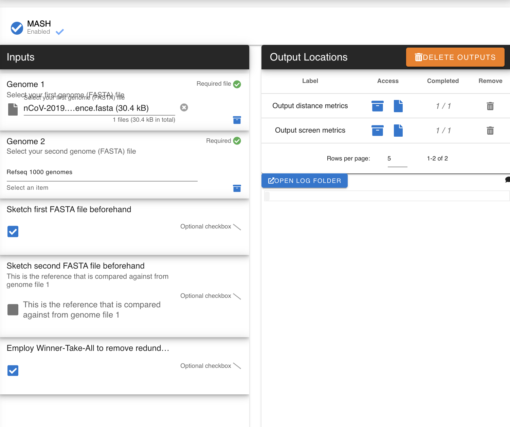
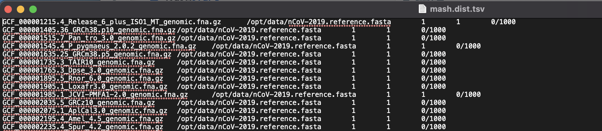
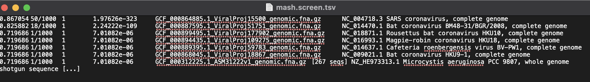

MASH
-----

`MASH <https://github.com/marbl/Mash>`_ 
 
MASH is for uncovering metagenomic distances using MinHash

.. mashdef:

-------
Parameters
-------

- FASTA genome file: `file` 

   Whatever genome file you want to uncover genomic distances from. Can be multipe entries. Can also be a consensus file

- Reference Genomes: `File`
   Can be Sketch format ``.msh`` or FASTA file. 

- Sketch File 1: `option`

   Speeds up the process for the input file 1

- Sketch File 2: `option`

   Speeds up the process for the input file 2

- Winnder Take All: `option`

   Only take the highest (best) distance annotations against the reference for your input file.    

-------
Returns
-------

1. Distance: `tab-separated file`

.. note::

   Columns:
      1. Reference-ID
      2. Query-ID
      3. Mash-distance
      4. P-value
      5. Matching-hashes

   See more information on calculaions `here <https://mash.readthedocs.io/en/latest/distances.html>`_

2. Screen: `tab-separated file`

.. note::

   Columns:
      1. identity
      2. shared-hashes
      3. median-multiplicity
      4. p-value
      5. query-ID
      6. query-comment
   See more information `here <https://mash.readthedocs.io/en/latest/tutorials.html#screening-a-read-set-for-containment-of-refseq-genomes>`_

