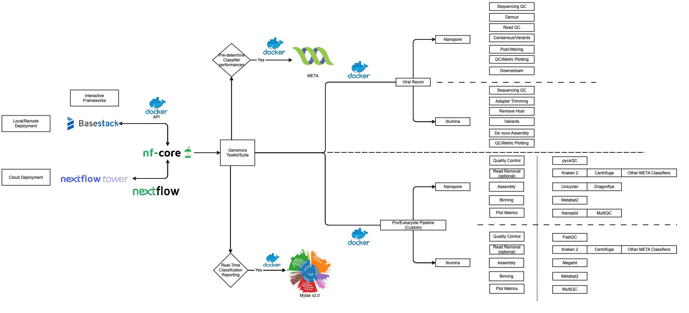

Metagenomics Triage Workflow (Under Construction)
-----

.. warning:: 
   This module is under construction

Standard diagram for deployment and pipeline development

The primary pipeline is comprised of 2 potential solutions for delivering real-time reporting measures

1. Viral
   - We will (potentially) use `Viral Recon <https://nf-co.re/viralrecon>`_ to perform all necessary steps for the initial triage process
2. Prokaryotic/Eukaryotic - JHUAPL Designed
   - We will continue to search for a more bundled version to perform the triage process, similar to the above described Viral Recon pipeline
   - Additionally, we will develop a modularized nf-core workflow utilizing the modules described in the workflow diagram above
   Steps:
      1. QC - `FASTQC <https://www.bioinformatics.babraham.ac.uk/projects/fastqc/>`_ Illumina, `pycoQC <https://github.com/a-slide/pycoQC>`_ Nanopore
      2. Read Removal Optional - `Kraken2 <http://ccb.jhu.edu/software/kraken2/>`_ , `Centrifuge <https://github.com/DaehwanKimLab/centrifuge>`_ , Other Classifiers
      3. Assembly - `Megahit <https://github.com/voutcn/megahit>`_ Illumina, `Unicycler <https://github.com/rrwick/Unicycler>`_ , `Dragonflye <https://github.com/rpetit3/dragonflye>`_ Nanopore
      4. Binning - `Metabat2 <https://www.ncbi.nlm.nih.gov/pmc/articles/PMC6662567/>`_
      5. Metrics - `MultiQC <https://github.com/ewels/MultiQC>`_ Illumina, `Nanoplot <https://github.com/wdecoster/NanoPlot>`_ , `MultiQC <https://github.com/ewels/MultiQC>`_ Nanopore

Additionally, we will deliver two new modules alongside the primary pipeline 

1. `Mytax v2.0 <https://github.com/jhuapl-bio/mytax>`_ Update
   - v1.0 is complete and operatable in Basestack and is JHUAPL managed
   - Issues:
      1. No watcher service to deliver results in real-time, requires one-off runs for each time you want results
      2. No intuitive dashboard that autoloads input files. This requires manual input from file locations for the UI to run
2. `META <https://github.com/JHUAPL/meta-system>`_
   - JHUAPL service that monitors and reports metrics on various metagenomic Classifiers 
      1. Resource Usage
      2. Database sizes
      3. Performance mesaured with area under precision recall curve (AUPRC)

Major Hurdles:

1. Integrate the JHUAPL pipeline into a nextflow, nf-core workflow
2. Adjust parameters to allow nextflow tower support
3. Integrate Mytax v2.0 (if possible) and META into Basestack