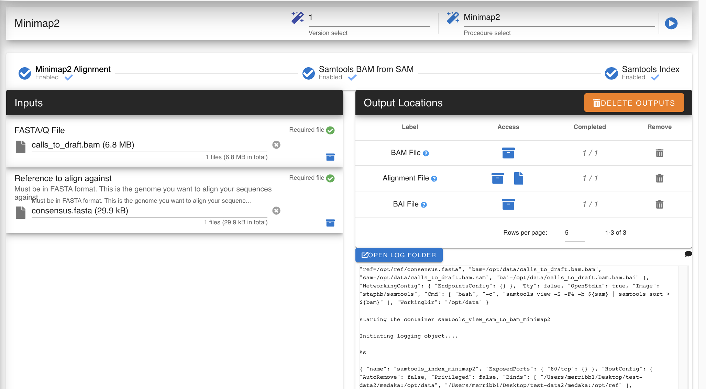
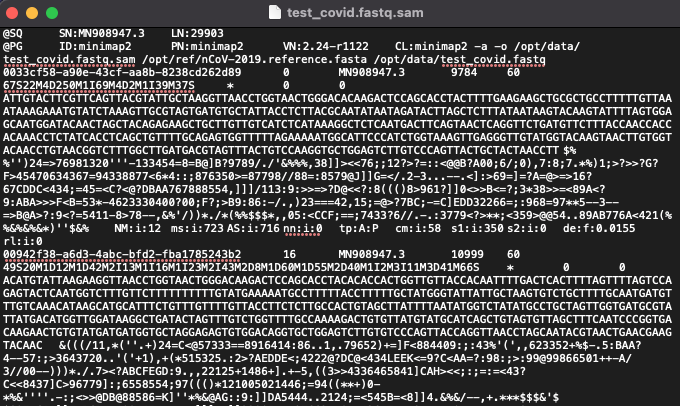

Minimap2
-----

`Minimap2 <https://github.com/lh3/minimap2>`_ 

Minimap2 performs alignment for genomic and spliced nucleotide files

.. minimap2def:

-------
Parameters
-------

- FASTQ/A file: `file` 

   Raw Reads file to run alignment against a reference on. 

- Reference FASTA: `File`
   Your original reference FASTA file during alignment. Must also be linked to the GFF3 described above
   

-------
Returns
-------

1. BAM: `file`
2. SAM: `file`

