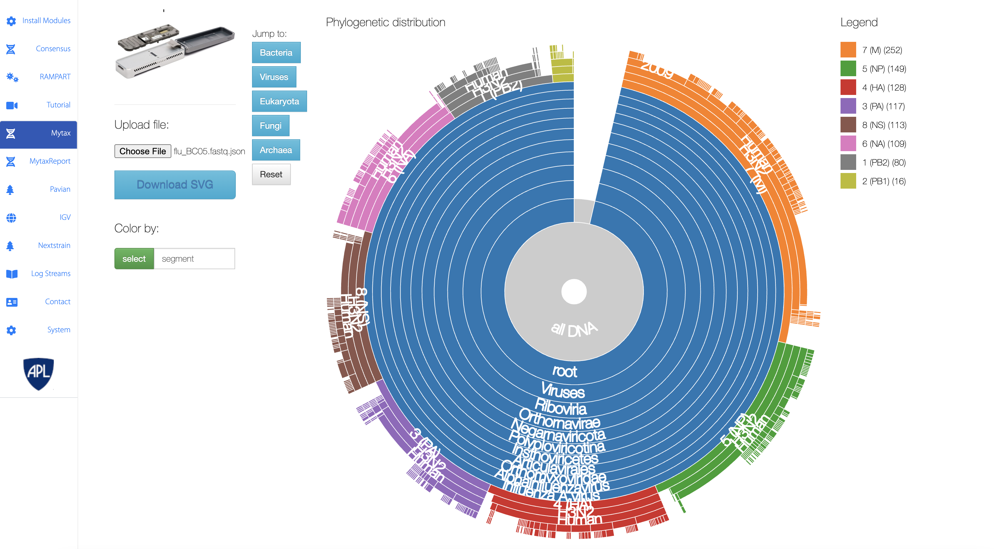

Mytax
======

`Mytax <https://github.com/jhuapl-bio/mytax>`_ is a tool designed to utilize the `Kraken2 <https://ccb.jhu.edu/software/kraken2/>` classification tool in order to identify (and visualize) taxonomic designations of fastq files. It includes a flu-kraken (from JHUAPL) and minikraken (from developers of kraken) set of databases in the installed images. 

There are 2 primary pipelines for this modules:

1. Create Report Files
    - Run kraken-classify to create kraken.report and kraken.json files from a single fastq file

2. Build Flukraken Database
    - Designed to create a new flukraken database

WIP Pipelines:

- Download and create/update custom databases
- Utilize other classifiers or aligners
    1. `Centrifuge <https://ccb.jhu.edu/software/centrifuge/>`_
    2. `Kraken2 <https://ccb.jhu.edu/software/kraken2/>`_
    3. `BLAST <https://blast.ncbi.nlm.nih.gov/Blast.cgi>`_

Once run, the pipeline will output 2 key files:

1. Kraken-Report
    - Used in Pavian and for additional 3rd-party applications
    - Contains a summary of the run
2. Kraken-JSON
    - Formatted file uploaded/used in the Mytax Sunburst Visualization.

