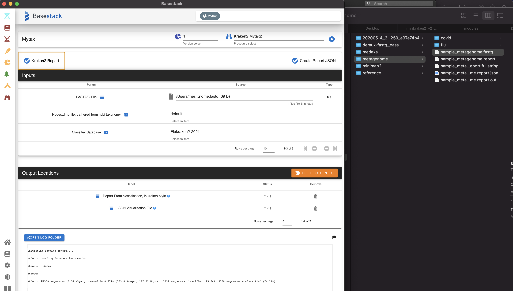

Mytax
======

`Mytax <https://github.com/jhuapl-bio/mytax>`_ is a tool designed to utilize the `Kraken2 <https://ccb.jhu.edu/software/kraken2/>` classification tool in order to identify (and visualize) taxonomic designations of fastq files. It includes a flu-kraken (from JHUAPL) and minikraken (from developers of kraken) set of databases in the installed images. 

.. note::
   This module contains a UI to be displayed from the rendering button in the variables table


There are 2 primary procedures for this module:

1. Create Report Files
    - Run kraken-classify to create kraken.report and kraken.json files from a single fastq file

2. View the Visualization
    - View the output JSON file from Step 1





-------
Parameters
-------

1. ``fastq file`` ``File`` - FastQ file (single) obtained from any sequencing run. You can consolidate multiple fastq files into one if you want to run a long sequencing run. 
2. ``Nodes`` ``Directory`` - Location of the taxonomy files. Default is contained within the ```jhuaplbio/basestack_mytax`` image and pre-loaded on run
3. ``Database`` ``Directory`` - Directory to use as the database for Kraken2. Defaults to Flukraken pre-loaded in the Docker image. 
4. ``Memory Mapping`` ``Option`` - Choose to pre-load the database (fast, requires high RAM) or run on the local filesystem (slow, only use with low RAM available)

-------
Returns
-------


1. Kraken-Report File (``.report``)
    - Used in Pavian and for additional 3rd-party applications
    - Contains a summary of the run
2. Kraken-JSON (``.json``)
    - Formatted file uploaded/used in the Mytax Sunburst Visualization Procedure.


------------------------------------------------------------------------------


-------
WIP Procedures
-------

- Download and create/update custom databases
- Utilize other classifiers or aligners
    1. `Centrifuge <https://ccb.jhu.edu/software/centrifuge/>`_
    2. `Kraken2 <https://ccb.jhu.edu/software/kraken2/>`_
    3. `BLAST <https://blast.ncbi.nlm.nih.gov/Blast.cgi>`_


-------
Display
-------

.. image:: ../assets/img/mytax_sunburst.png 
   :width: 100%