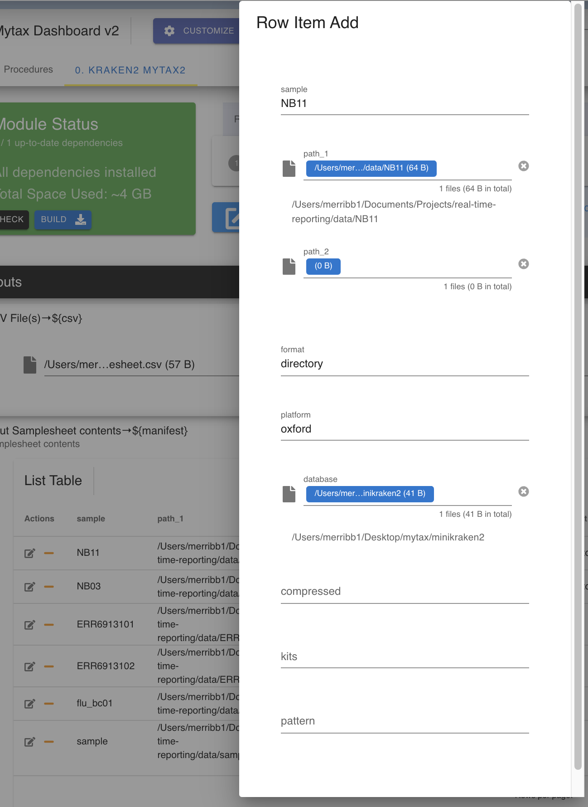

Mytax version 2 (Metagenomics)
-----

.. warning:: 
   This module is under construction and is in alpha-release. Scheduled full release of v1.0 in Oct. 2022

**Please see relevant links in the listed modules for more information on the underlying mechanisms and corresponding papers (if existent)**

-------
Parameters
-------

- Samplesheet (.csv): `file` 

   Contains a mapping of metadata and a single sample per row. Explanations of the possible columns for Basestack are seen below:

.. list-table:: Samplesheet Description
   :header-rows: 1
   :stub-columns: 1
   :class: my-class
   :name: my-name

   * - Column Name
     - Description

   * - sample
     - Custom sample name. This entry will be identical for multiple sequencing libraries/runs from the same sample. Spaces in sample names are automatically converted to underscores (`_`).
   * - format
     - [directory, run, file] Is it a run directory of files that need to be demux'd, an already full directory of files for Oxford, or a single file (or paired files)
   * - path_1
     - Full path to FastQ file for Illumina short reads 1 OR OXFORD reads. File has to be gzipped and have the extension ".fastq.gz" or ".fq.
   * - path_2
     - Full path to FastQ file for Illumina short reads 2. File has to be gzipped and have the extension ".fastq.gz" or ".fq.
   * - kits
     - What default barcode kit to use for demux. Only applies to those with the "run" format
   * - pattern
     - Regex matching for the names of the folders that are made on demux. Default is barcode[0-9]+
   * - platform
     - Platform used, [illumina, oxford]
   * - database
     - Kraken2 database path (root level folder)
   * - compressed
     - TRUE/FALSE for gunzipped files
     

.. list-table:: Example Samplesheet
   :header-rows: 1
   :stub-columns: 1
   :class: my-class
   :name: my-nametwo

   * - sample
     - path_1
     - path_2
     - format 
     - platform 
     - database
     - compressed
     - pattern
     - kits
     
   * - covid_run
     - fastq_pass
     - NULL
     - run
     - oxford
     - NULL
     - NULL
     - barcode[0-9]+
     - EXP-NBD103
   * - NB03
     - ./NB11
     - NULL
     - directory
     - oxford
     - minikraken2
     - FALSE
     - NULL
     - NULL
   * - ERR123
     - ERR123_R1.fastq.gz
     - ERR123_R2.fastq.gz
     - file
     - illumina
     - flukraken2
     - TRUE
     - NULL
     - NULL

-------
Returns
-------

1. Barcode Folders OPTIONAL. This will only be generated if you input a run in the data sheet and opt to set barcoding (demux) on it from the Data Sheet view
2. Kraken2 Classifiction Reports. Each will be output in the same folder as the sample of interest as full.report. Full.report is the aggregation of all reports for all fastqs attributed to a sample

-------
Display
-------

If you need to edit a specific field directly within the UI, you can do so by selecting the pencil icon or adding a New Item

Within the dashboard, you can view all reports being generated in real time as the sunburst, sankey, table, or tops tab. These will be automatically 
started as soon as you access the website url and basestack has loaded the model as running.

.. image:: ../assets/img/Mytaxv2_dashboard.png 
   :width: 100%

.. warning:: 
   If the app doesn't start automatically classifying, try to refresh the page

At the top of the page on the right, you can adjust your samplesheet. 

.. warning::
    If run with Basestack, this will be limited in scope since you are running on data mounted with Docker.
    Any changes must be made with Basestack regarding adjusting data that is to be seen not from the Data Sheet directly. 

