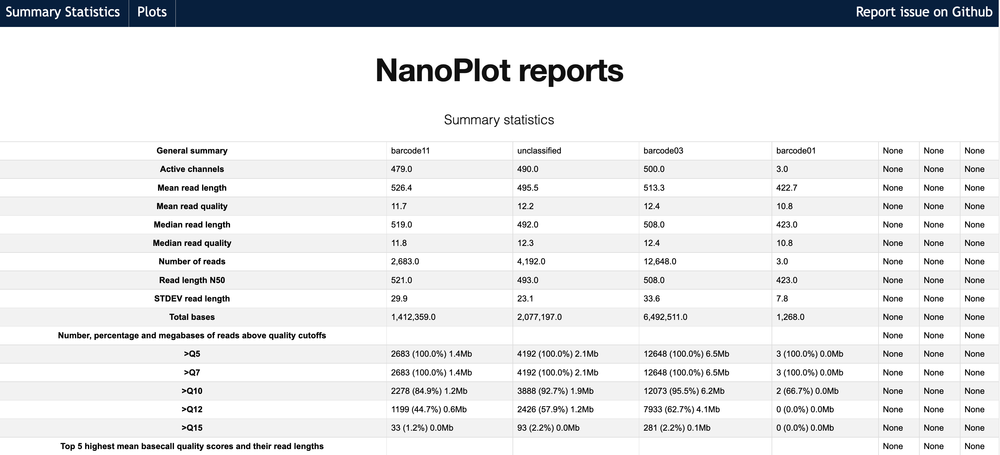
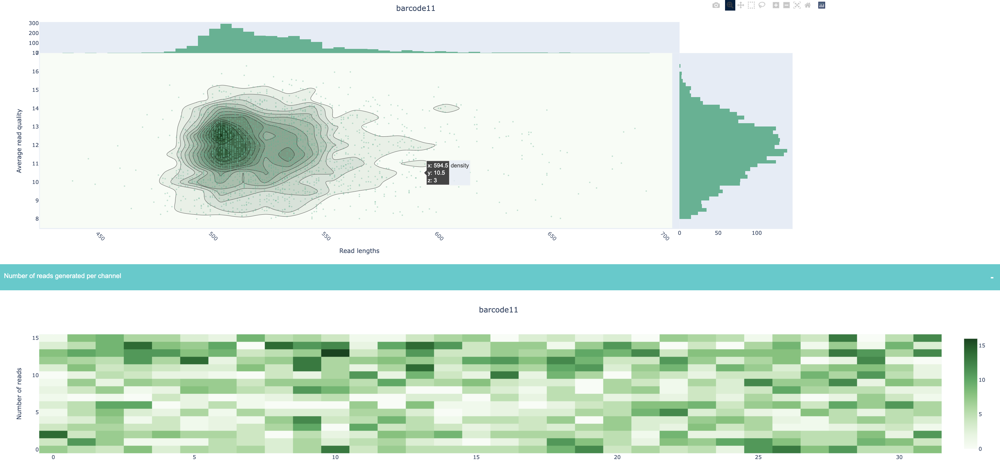

NanoPlot
-----

`NanoPlot <https://github.com/wdecoster/NanoPlot>`_ is a tool designed to view the quality and do control on raw sequencing data from long-read runs

.. note::
   This module outputs an html file that is a report of your raw sequencing data

-------
Parameters
-------

- input file: `file` 
   Can be one of these list:
   
   1. fastq file [file ...]
                        Data is in one or more default fastq file(s).
   2. fasta file [file ...]
                        Data is in one or more default fasta file(s).
   3. fastq_rich file [file ...]
                        Data is in one or more fastq file(s) generated by albacore or MinKNOW with
                        additional information concerning channel and time.
   4. fastq_minimal file [file ...]
                        Data is in one or more fastq file(s) generated by albacore or MinKNOW with
                        additional information concerning channel and time. Minimal data is extracted
                        swiftly without elaborate checks.
   5. summary file [file ...]
                        Data is in one or more summary file(s) generated by albacore or guppy.
   6. bam file [file ...]
                        Data is in one or more sorted bam file(s).

.. note::
   Input information taken from the ``--help`` output of ``NanoPlot``

- barcoding file: `optional - file` 
   Must only be given when using the ``summary file`` option

-------
Returns
-------

Report file : `HTML file`
   

