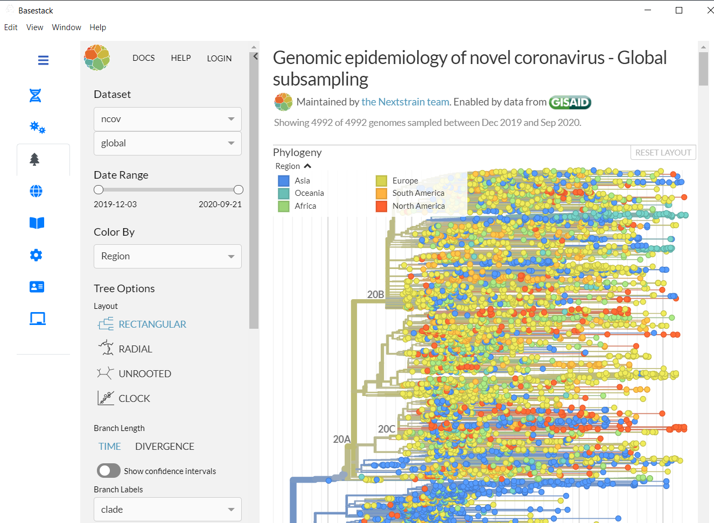
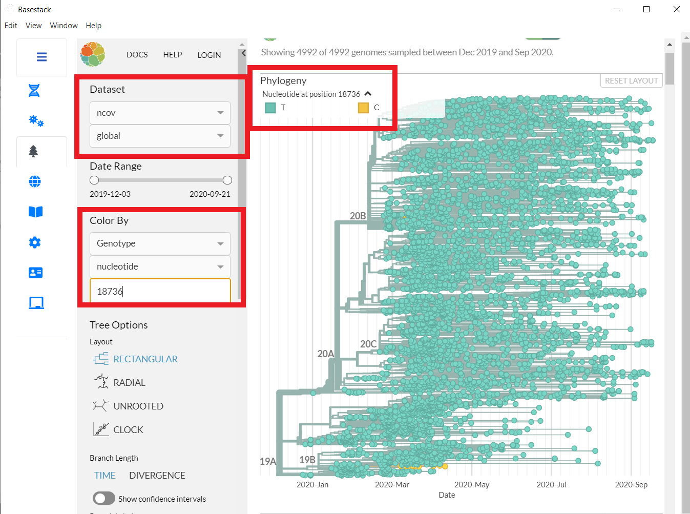

Nextstrain
-----

After the app has generated consensus genomes from the previous 2 commands, you can view mutations or SNPs in your run by selecting the Nextstrain tab at the left-hand side. These mutations can be viewed around ``Page 11`` or ``section 5.3``

Let's go into our report we just generated and traverse to ``section 5.3`` or ``page 10-11``. The tables provided are all reported mutations against the reference.

.. note::
    Page and Section references refer to reports generated from :ref:`basestack_consensus`

- Position 18736 (for example) is a reported SNP for T to C mutation. The annotatin is a missense_variant (see all annotation types in the description of this figure for the report). Though nextstrain we can view this mutation across all samples available that have been sequences and input into nextstrain's website. 

- Now that we've selected our mutation to view let's move forward through the interactive site

To View a specific mutation (and this one for example) reported in the table, select underneath **Color By**

Genotype -> nucleotide -> [Your number here]

Also, be sure that the dataset is ncov and global. You can change the layout of the visualization(s) with the Tree Options parameters

.. note::
    Requires Internet. Also available at https://nextstrain.org/ncov/global