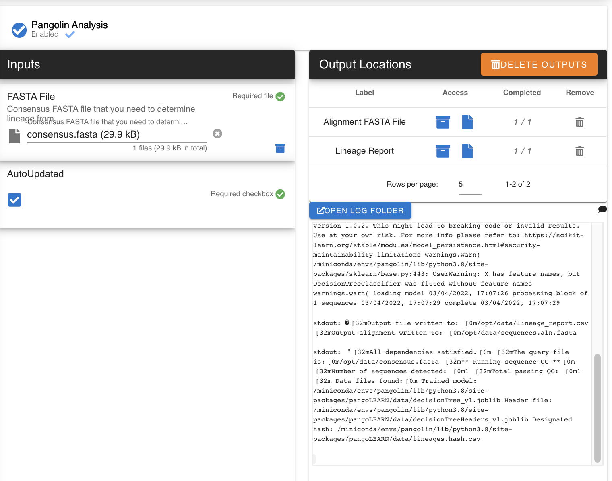
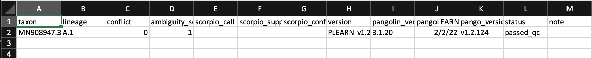

Pangolin
-----

`Pangolin <https://github.com/cov-lineages/pangolin>`_ 

Software package for assigning SARS-CoV-2 genome sequences to global lineages.

.. pangolindef:

-------
Parameters
-------

- FASTA file: `file` 

   Genome file, can be a multi-sequence FASTA file

- AutoUpdate: `option`

.. note::
   Pangolin updates so frequently, opt to check for updates before running. Requires Internet access
   

-------
Returns
-------

1. Pangolin Lineage Report: `comma-delimited file`
2. alignment FASTA: `sequences.aln.fasta, contains your alignment from pangolin`

