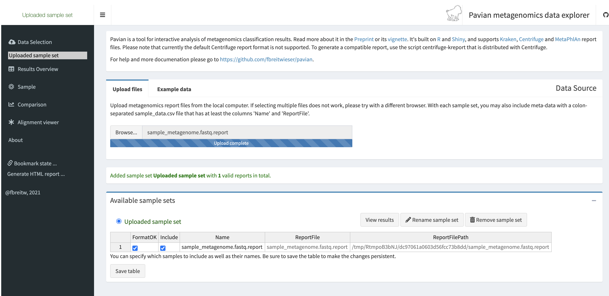
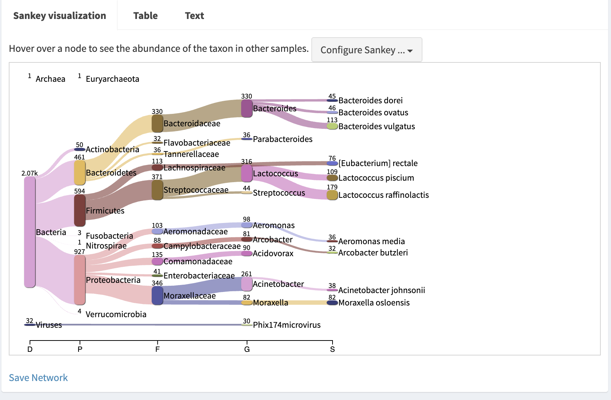

Pavian
-----

`Pavian <https://github.com/fbreitwieser/pavian>`_ is a tool designed to analyze report files from a variety of classification modules, namely, for Basestack, 
`Mytax <https://github.com/jhuapl-bio/mytax>`_ uses `Kraken2 <https://ccb.jhu.edu/software/kraken2/>`_

.. note::
   This module contains a UI to be displayed from the rendering button in the variables table

-------
Parameters
-------

1. ``report file`` ``File`` -  Report file from Kraken2 run. See :doc:`here <mytax>`.  To be input INSIDE the running visualization. See images below

-------
Returns
-------

1. Pavian Visualization
 
The tool simply requires you to input your kraken.report (from mytax or otherwise) into the home-page. 

Select ``Sample`` in the left-hand navigation drawer to view diagrams and information of your report

