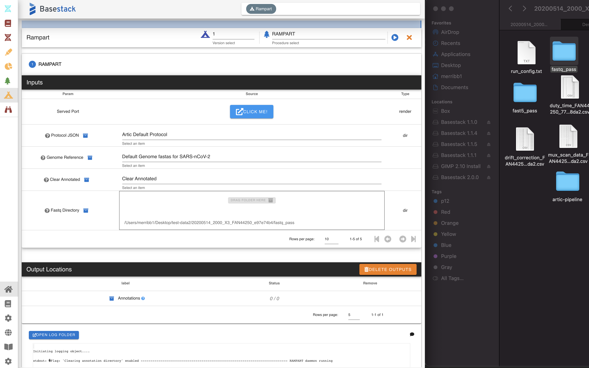
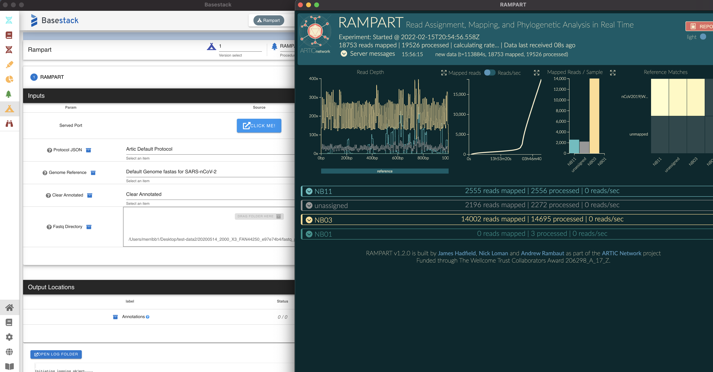

Rampart
-----

Rampart is an annotation tool provided by the Artic Network that gives quick, but less accurate reports for each of your demuxed samples. It is ideal for a quick look into what the annotations for each of your barcodes are but should not be fully relied on, instead opt for the pipeline that was just discussed.

.. note::
   This module contains a UI to be displayed from the rendering button in the variables table

-------
Parameters
-------

1. ``Fastq Dir`` ``Dir`` - Run annotation of SARS-nCoV-2 sequences within the RAMPART suite
2. ``Annotated Clear`` ``Option`` - Remove your annotated folder if you want to do a fresh run. Annotations will be removed from the same directory as the ``Fastq Dir``

-------
Returns
-------

1. Annotations (``./annotations``)
   - Select ``Click Me!`` button to render RAMPART in the UI

------------------------------------------------------------------------------

1. Ensure you've loaded a run that has been bookmarked from the previous tab (described above). 
2. Select one of the included primer-schemes from the drop-down list. For this example, the data is ncov-related so we will choose ``Default Genome fasta for SARS-nCoV-2``.
3. Select the ``Click Me!`` button to render Rampart in a new window

