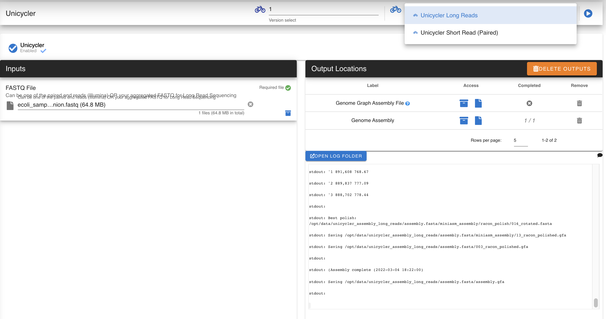
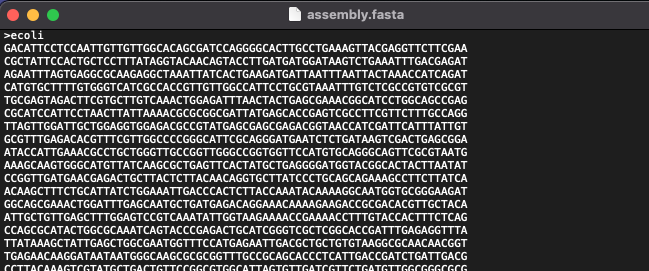
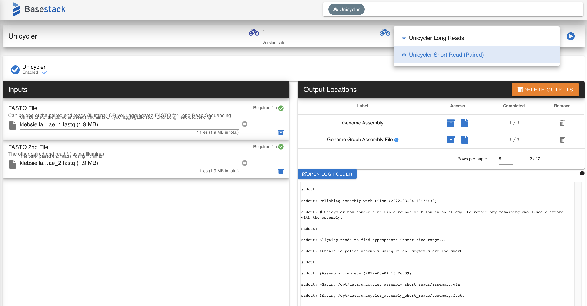

Unicycler
-----

A hybrid assembly pipeline for bacterial genomes

`Unicycler <https://github.com/rrwick/Unicycler>`_ 
 
<strong>This pipeline uses SPAdes</strong>

.. unicyclerdef:

Unicycler Long Reads
^^^^^^^^^^^^^

-------
Parameters
-------

- FASTQ file: `file` 

   Sequencing raw read file. Can be short or long read

-------
Returns
-------

1. Genome Assembly: `Tab-separated annotation`

   Assembly FASTA File

2. GFA File: `File`

   Can be used in 3rd party tools like `Bandage <https://github.com/rrwick/Bandage>`_

Unicycler Short Reads
^^^^^^^^^^^^^

-------
Parameters
-------

- FASTQ first file: `file` 

   First Read file (paired or single-end) 

- FASTQ second file: `file` 

   Second read file (paired only)

-------
Returns
-------

1. Genome Assembly: `Tab-separated annotation`

   Assembly FASTA File
   
2. GFA File: `File`

   Can be used in 3rd party tools like `Bandage <https://github.com/rrwick/Bandage>`_
   
