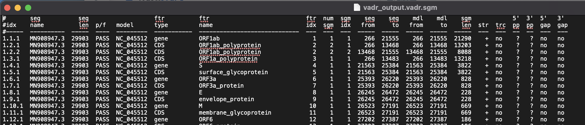

VADR
-----

Viral Annotation DefineR: classification and annotation of viral sequences based on RefSeq annotation

`VADR <https://github.com/ncbi/vadr>`_ 
 
VADR is a suite of tools for classifying and analyzing sequences homologous to a set of reference models of viral genomes or gene families. It has been mainly tested for analysis of Norovirus, Dengue, and SARS-CoV-2 virus sequences in preparation for submission to the GenBank database.

.. vadrdef:

-------
Parameters
-------

- FASTA consensus file: `file` 

   Sequencing file you want to get viral annotations from in the VADR pipeline

- Reference Genome: `option or File`
   Can be Sketch format ``.msh`` or FASTA file. 

-------
Returns
-------

1. Table format: `Tab-separated annotation`

   5 column feature table output for passing sequences

2. sgm format: `Tab-separated annotation`

   per-model-segment tabular summary file 

   

3. sqa format: `Tab-separated file`

   per-sequence tabular annotation summary file 

All output files created in directory your directory containing your input FASTA file under ``vadr_output`` 

.. note::

   See more information `here <https://github.com/ncbi/vadr/wiki/Coronavirus-annotation#many-alertserrors-in-orf3a-orf6-orf7a-orf7b-orf8-and-orf10-do-not-cause-a-sequence-to-fail-1`_

   1. Output printed to screen saved in:                              my4.vadr.log
   2. List of executed commands saved in:                             my4.vadr.cmd
   3. List and description of all output files saved in:              my4.vadr.filelist
   4. esl-seqstat -a output for input fasta file saved in:            my4.vadr.seqstat
   5. 5 column feature table output for passing sequences saved in:   my4.vadr.pass.tbl
   6. 5 column feature table output for failing sequences saved in:   my4.vadr.fail.tbl
   7. list of passing sequences saved in:                             my4.vadr.pass.list
   8. list of failing sequences saved in:                             my4.vadr.fail.list
   9. list of alerts in the feature tables saved in:                  my4.vadr.alt.list
   10. fasta file with passing sequences saved in:                     my4.vadr.pass.fa
   11. fasta file with failing sequences saved in:                     my4.vadr.fail.fa
   12. per-sequence tabular annotation summary file saved in:          my4.vadr.sqa
   13. per-sequence tabular classification summary file saved in:      my4.vadr.sqc
   14. per-feature tabular summary file saved in:                      my4.vadr.ftr
   15. per-model-segment tabular summary file saved in:                my4.vadr.sgm
   16. per-alert tabular summary file saved in:                        my4.vadr.alt
   17. alert count tabular summary file saved in:                      my4.vadr.alc
   18. per-model tabular summary file saved in:                        my4.vadr.mdl
   19. alignment doctoring tabular summary file saved in:              my4.vadr.dcr
   20. ungapped seed alignment summary file (-s) saved in:             my4.vadr.sda
   21. replaced stretches of Ns summary file (-r) saved in:            my4.vadr.rpn
