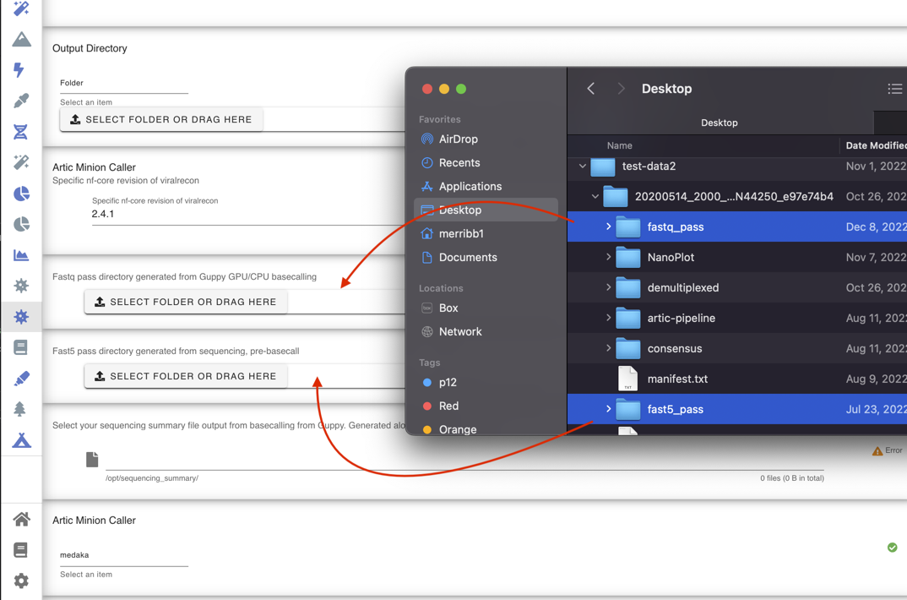

Viral Recon
-----

nf-core/viralrecon is a bioinformatics analysis pipeline used to perform assembly and intra-host/low-frequency variant calling for viral samples. The pipeline supports both Illumina and Nanopore sequencing data. For Illumina short-reads the pipeline is able to analyse metagenomics data typically obtained from shotgun sequencing (e.g. directly from clinical samples) and enrichment-based library preparation methods (e.g. amplicon-based: ARTIC SARS-CoV-2 enrichment protocol; or probe-capture-based). For Nanopore data the pipeline only supports amplicon-based analysis obtained from primer sets created and maintained by the ARTIC Network.*

*Pulled from [https://nf-co.re/viralrecon](https://nf-co.re/viralrecon)

.. note::
   The modules runs nextflow on the backend and thus utilizes Docker within Docker. 

-------
Parameters
-------

Fastq Dir : `Dir` 
   Basecalled Fastq files
Fast5 Dir : `Dir` 
   Fast5 files directory from which you received the basecalled fastq directory of files from
-------
Returns
-------

Consensus : `./viralrecon/medaka|nanopolish`
   - Consensus FASTA files are made for both assembly processes
MultiQC Report: `./viralrecon/multiqc/multiqc_report.html`
   - HTML files that has information of your run 
------------------------------------------------------------------------------

1. Ensure you've loaded a run with a fastq and fast5 directory specified

2. Select one of the included primer-schemes from the drop-down list. For this example, the data is ncov-related so we will choose ``Default Genome fasta for SARS-nCoV-2``.
3. Select one of the basecaller options `medaka` or `nanopolish`
4. Select the ``Play button`` button to start the pipeline

.. raw:: html
   :file: ../assets/img/multiqc_report_viralrecon.html
