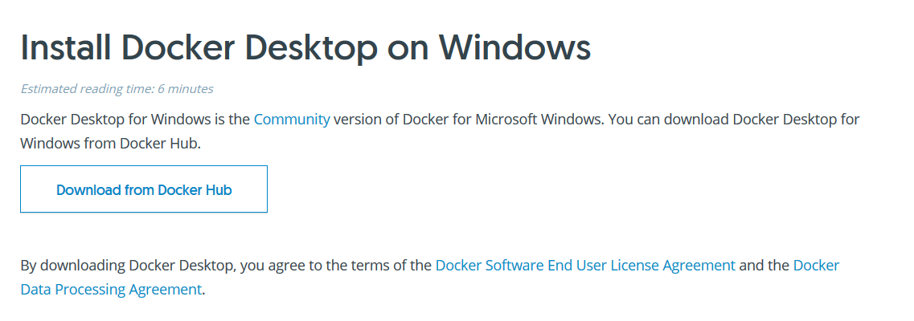
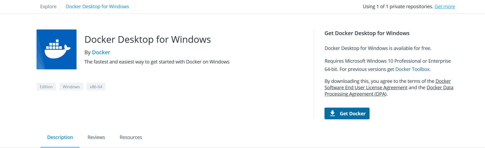
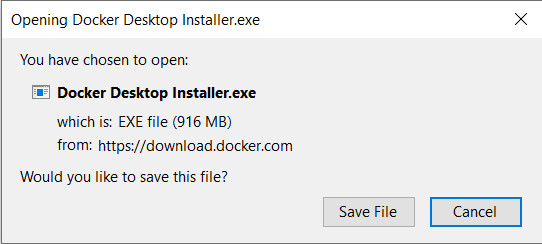
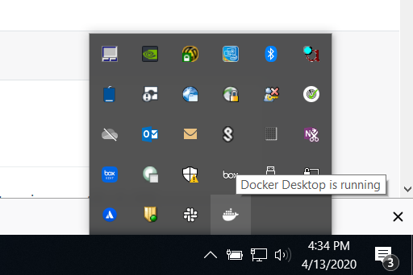
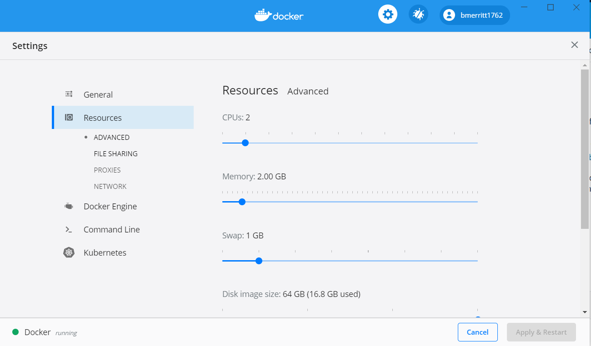
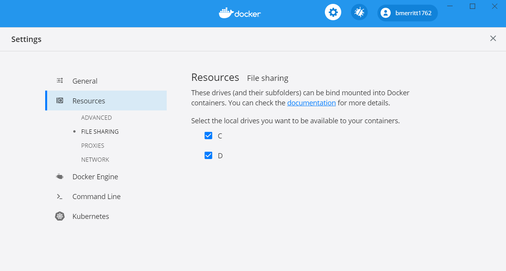
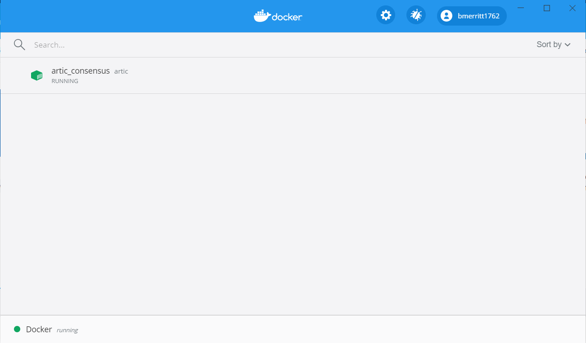

`Docker <https://docs.docker.com/docker-for-windows/install/>`_
------

Docker Download + Install
#### 

1. Head over to the `Docker <https://docs.docker.com/docker-for-windows/install/>`_ website to download the necessary package

.. collapse:: Check Processor support for Docker (Click to expand)

   In order to run docker you must be able to support virtualization from your CPU. This feature must also be enabled within your BIOS and Windows Features. 
   
   See more of :ref:`Troubleshooting Virtualization` for more details

   If you're unsure whether docker is supported by your specific cpu, please visit and input your specific model number:

   - `Intel <https://ark.intel.com/content/www/us/en/ark.html>`_
   - `AMD <https://www.amd.com/en/products/specifications/processors>`_

   Type Your Model Number, e.g. T6500 into the product search bar

   .. image:: ../assets/img/intel_product_example_annotated.png
      :width: 100%

   In this example above, you can see that Vt-x (Virtualization) is not supported. This will be a **Yes** if it is supported.

   To find the cpu model on Windows:

   .. image:: ../assets/img/system_info_cpu_windows.PNG
      :width: 100%

.. raw:: html

   

2. Choose **Get Docker**

3. Choose **Save File** from the prompt

4. Once you've installed docker for Windows, you can start it at the **Quick Launch** by search **Docker**. You can also view it on your right-hand-bottom tray by right-clicking

5. Here Docker provides a GUI environment to manage your system. You can allocate or limit resources to your containers as well as set networking settings if you'd like. **We use default values for our app**

6. **OPTIONAL** Choose Local drives to share with containers. Useful if you're storing data on an external drive.

7. Main image that allows you to manage specific containers 

Confirm Docker is Running
#### 

In your taskbar (lower-right), if you hover over the icon you should see the message displayed below. Right-clicking will give additional options

Basestack
-------

Install Main
######

Download Basestack from `Releases <https://github.com/jhuapl-bio/Basestack/releases/latest>`_

- You will select the item labeled ``<Basestack-Version>.Setup.exe``

1. Double-click ``Basestack-Version.Setup.exe``
2. Follow the prompts for installing the software. Choose defaults unless otherwise needed.

